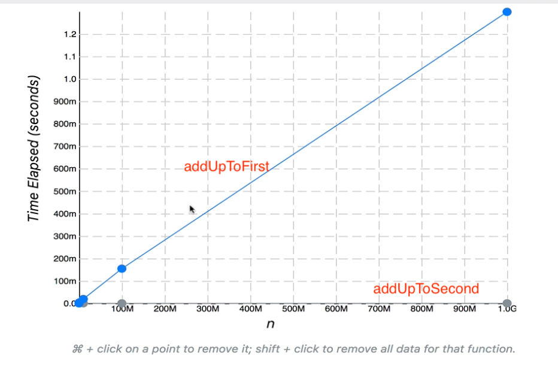

# JavaScript 자료구조&알고리즘

> 출처: [JavaScript 알고리즘 & 자료구조 마스터클래스](https://www.udemy.com/course/best-javascript-data-structures/)

# Section 01. 빅오 표기법 (Big O Notation)

### Objectives

- 빅오 표기법(Big O Notation)의 필요성
- 빅오 표기법 정의
- 빅오 표기법을 간단하게 표현하는 방법
- "시간 복잡도"와 "공간 복잡도" 정의
- 빅오 표기법을 사용해서 여러가지 알고리즘 평가
- 로그(Logarithm) 정의

## Big O의 필요성

- 여러가지 코드를 일반적으로 서로 비교하고 성능을 평가하는 방법
- 자신이 만든 해결책, 알고리즘이 만족스럽다고 하더라도 다른 해결책과 비교하고 성능이 어떤지 이해하는 것이 도움됨
- 에러만을 찾는 것이 아니라, 코드가 작동하지만 더 오랜 시간이 걸리거나, 브라우저에서 함수를 실행할 때 자신이 만든 비효율적인 코드를 이해하고 있어야 함

### 코드 시간 재기

- 1에서부터 특정한 N 갑소가 사이에 있는 모든 숫자들을 더하는 함수를 쓰고 싶다고 생각
  - ex) 1 + 2 + 3, 6

#### 가장 생각하기 쉬운 해결법

```javascript
function addUpToFirst(n) {
  let total = 0;
  for (let i = 0; i <= n; i++) {
    total += i;
  }

  return total;
}
```

#### 다른 해결법

```javascript
function addUpToSecond(n) {
  return (n * (n + 1)) / 2;
}
```

- 루프를 사용하지 않고 수학 공식에 가까운 해결법

### 더 나은 코드는?

- 여기서 **_"더 나은"_**이란 무슨 의미?
  - 어떤 코드가 더 빠르다는 것을 의미?
  - 메모리를 얼마나 사용하는지를 의미?
  - 코드를 얼마나 쉽게 읽을 수 있는지를 의미?
  - 우선 속도에 초점을 맞춰서 비교할 예정
- 물론, 좋은 코드를 쓴다는 것은 **_많은 메모리 양을 사용하지 않는 효율적인 코드를 쓰면서 읽기 쉬운 점 두 가지를 잘 조율하는 것!_**

### timer function를 사용한 속도 비교

```javascript
function addUpToFirst(n) {
  let total = 0;
  for (let i = 1; i <= n; i++) total += 1;
  return total;
}
let t1 = performance.now();
addUpTo(100000000);
let t2 = performance.now();
console.log(`Time Elapsed: ${(t2 - t1) / 1000} seconds.`);
```

```javascript
function addUpToSecond(n) {
  return (n * (n + 1)) / 2;
}
let t1 = performance.now();
addUpTo(100000000);
let t2 = performance.now();
console.log(`Time Elapsed: ${(t2 - t1) / 1000} seconds.`);
```

#### 똑같은 데이터를 다루지만 2번 코드가 훨씬 더 짧은 시간 안에 해냈다는 것을 확인할 수 있음

- 이렇게 수동으로 타이밍을 구하고 서로 비교하는 것이 가장 좋은 방법은 아님
  - 기기 사양에 따라 다를 수 있고, 그 기계 무엇이 실행되고 있는지에 따라서 다를 수도 있음
  - 똑같은 기계가 다른 시간을 기록할 수도 있음
  - 빠른 알고리즘에서는 정말 짧은 시간 안에 모든 것이 처리된다는 것
  - 이런 경우에 속도 측정 정확도가 충분하지 않을 수 있음

### 연산 갯수 세기

#### 시간을 사용하지 않는다면 무엇을 사용할까?

- 코드가 실행될 때 걸리는 정확한 시간을 초로 측정하는 것 보다는 **_컴퓨터가 처리해야 하는 연산 개수_**를 세면 된다.
- 어떤 컴퓨터를 사용하든 그 갯수는 변하지 않기 때문이다.

#### 연산 개수 세기

```javascript
function addUpToSecond(n) {
  return (n * (n + 1)) / 2;
}
```

- 1 곱셈(multiplcation), 1 덧셈(addition), 1 나눗셈(division)
  - n이 어떤 값을 갖고 있든 연산은 3번만 이루어진다는 것을 알 수 있다.

```javascript
function addUpToFirst(n) {
  let total = 0;
  for (let i = 1; i <= n; i++) total += i;
  return total;
}
```

- +가 연산으로 루프 안에 있기 때문에 위와는 조금 다르다. n이 5라면 연산이 5번, 1억이라면 1억번 이루어진다.
  - **_즉, n 개수의 연산인 것!_**
- 그 외의 연산으로 for 문 안의 ++, +=에서 =, i <= n 등 추가적인 연산이 있다.
- 연산의 총 개수는 5n + 2이지만 그것보다 중요한 것은 **_전체적인 추세를 보는 것!_**
  - 즉, n이 커질수록 연산의 개수도 비례적으로 늘어난다는 전체적인 그림을 볼 수 있어야 한다.

## 빅오 개념

- 대략적으로 숫자를 세는 것에 붙인 공식적인 표현
- 정식으로 입력된 내용이 늘어날수록 알고리즘에 실행시간이 어떻게 변하는지 설명하는 공식적인 방식
- 즉, 빅오는 어떤 함수의 **_입력값이 늘어나는 것_** 과 **함수 실행 시간** 이 변하는 관계를 의미한다.
  - 단, 오로지 **_전반적인 추세_** 에 주목하는 것이 중요!
- We say that an algorithm is O(f(n)) if the number of simple operations the computer has to do is eventually less than a constant times f(n), as n increases
  - 컴퓨터가 해야 하는 간단한 연산의 수가 n이 증가함에 따라 f(n)의 상수보다 적다면 그 알고리즘을 O(f(n))으로 표현한다.
  - f(n) could be linear (f(n) = n) => n의 값이 커질수록 실행 시간도 같이 늘어나는 선형의 형태
  - f(n) could be quadratic (f(n) = n^) => n의 값이 커질수록 실행 시간이 n의 제곱인 형태
  - f(n) could be constant (f(n) = 1) => n의 값이 커져도 실행 시간에 아무 영향도 받지 않는 상수의 형태
  - f(n) could be something entirely different! => 완전히 다른 관계를 가질 수도 있음!
- 빅오를 얘기했을 때는 실행시간이 갖을 수 있는 최대치!

#### 빅오를 통한 addUpTo 비교

<p  align="center">
  
</p>

- addUpToFirst => O(n), n의 값이 커질수록 실행 시간이 1:1 비율로 늘어남
- addUpToSecond => O(1), n의 값이 커져도 아무런 변화가 없음

#### countUpAndDown

```
function countUpAndDown(n) {
	console.log("Going up!");
	for (let i = 0; i < n; i++) { // O(n)
		console.log(i);
	}
	console.log("At the top!\nGoing down...");
	for (let j = n - 1; j >= 0; j--) { // O(n)
		console.log(j);
	}
	console.log("Back down. Bye!");
}
```

- 빅오를 O(2n)이라고 생각할 수 있지만 그것 보다는 O(n)이라는 큰 그림만 신경써야 한다!

#### 이중 중첩 루프

```javascript
function printAllPairs(n) {
  for (var i = 0; i < n; i++) {
    // O(n)
    for (var j = 0; j < n; j++) {
      // O(n)
      console.log(i, j);
    }
  }
}
```

- O(n)으로 단순화되는 O(2n)이 아니라 중첩되어 있기 때문에 O(n^)이다.
  - 즉, n이 커질수록 실행 시간이 n제곱의 값으로 늘어난다는 것!
  - ex) n=2일 때 연산 개수가 4라면, n=3일 때 연산 개수는 9가 된다.

### 빅오 표현식의 단순화

- 상수, 작은 연산에 신경쓰지 않아도 된다. => **_큰 그림, 추세를 보는 것이 더 중요!_**
- O(2n), O(n + 100), O(1000n + 50) => O(n)
  - 연산 개수가 늘어남에 따라 실행 시간도 linear 형태로 늘어나는 형태임
- O(500) => O(1)
  - 연산 개수가 어떤 상황에도 500개이므로 실행 시간에 영향을 미치지 않아 그래프가 constant 형태임
- O(13n^), O(N^2 + 5n + 8) => O(n^)
  - 연산의 개수가 늘어남에 따라 실행 시간이 n^만큼 늘어나는 quadratic 형태임

### 빅오 명심해야할 점

- 빅오의 복잡도를 분석할 때는 매우 복잡해짐
- 따라서 항상 맞지는 않지만 쉽게 적용할 수 있는 규칙이 있다.
  - **_산수는 상수라는 것_** (덧셈, 뺄셈, 곱셈, 나눗셈 포함)
    - 컴퓨터가 2+2를 처리하는 시간과 100만 + 2를 처리하는 시간은 비슷
  - **_변수 배정도 상수_**
    - 컴퓨터가 변수에 값을 배전하는데 걸리는 시간은 비슷하다.
  - **\_인덱스를 사용해서 배열 엘리먼트를 접근하는 것도 상수\_\_**
    - 배열에서 첫 번째 엘리먼트든, 10번째 엘리먼트를 찾던 똑같은 시간이 걸린다.
  - **_루프가 있다면 복잡도가 루프의 길이 곱하기_**
    - 리스트에 있는 데이터를 루프로 처리할 때 0에서 n까지 간다면, 루프가 반복되는 횟수가 늘어난다.
    - 만약 중첩 루프가 있다면, n제곱 실행 시간이 된다.

### 빅오 단순화 그래프


## 공간 복잡도

### 시간 복잡도

- 입력값의 크기에 따라 알고리즘들이 얼마나 빠르게 실행하는지 분석하는 것을 **\_시간 복잡도** 라고 한다.

### 공간 복잡도

- 입력값이 커질수록 알고리즘이 얼마나 많은 공간을 차지하는지에 대한 값
- 공간, 사용되는 메모리에 주목!
- **_보조 공간 복잡도(auxiliary space complexity)_**
  - 당연히 n이 커질수록 입력 자체가 커지는데 그 부분을 무시해서 공간 복잡도를 공부할 예정
  - 즉, 입력되는 것을 제외하고 알고리즘 자체가 필요로 하는 공간을 의미, **_중요한 것은 알고리즘 자체!_**
  - 입력이 차지하는 공간응 관심없고, 알고리즘 자체가 어떤 영향을 주는지 자세히 봐야 한다.
  - 따라서, 공간 복잡도라고 다음 말할 때 사실상 보조 공간 복잡도를 말하는 것 유의!

### Space Complexity in JS

- **_Most primitives (booleans, number, undefined, null) are constant space_**
  - 불리안, 숫자, undefined, null은 자바스크립트에서 모두 불변 공간
  - 그렇기 때문에 입력의 크기와는 상관업이 1이든 100000000이든 모두 같은 공간을 차지
- **_String require O(n) space (where n is the string length)_**
  - 문자열은 O(n) 공간이 필요하다.
  - n이 문자열의 길이라면 50자인 문자열은 길이가 1자인 문자열보다 50배 많은 공간을 차지
- **_Reference types are generally O(n), where n is the length (for arrays) or the number of keys (for objects)_**
  - reference 타입, 배열과 객체도 대부분 O(n)으로 생각
  - n은 배열의 길이이거나 객체의 키 개수일 수 있다.
  - 배열의 길이가 4인 배열이 배열의 길이가 2인 배열보다 2배 더 많은 공간을 차지

### 공간 복잡도 예시

```javascript
function sum(arr) {
  let total = 0;
  for (let i = 0; i < arr.length; i++) total += arr[i];
  return total;
}
```

- sum 함수는 배열을 아규먼트로 받아서 그 배열 안에 있는 모든 엘리먼트를 합쳐 total 변수를 리턴한다.

#### 시간이 아닌 공간을 차지하는 것들이 무엇일까?

- 배열의 길이와는 상관없이 total 변수
- 루프 안의 let i = 0 변수
- 시간이 걸릴 뿐 공간이 할당되어 있는 변수는 두 개가 끝!
- 그렇기 때문에 배열의 크기와는 상관없이, n이 커져도 입력의 크기가 차지하는 공간과는 아무 상관없다!
  - **_따라서 결국 상수 공간으로 있다는 것 => O(n)_**

```javascript
function double(arr) {
  let newArr = [];
  for (let i = 0; i < arr.length; i++) newArr.push(2 * arr[i]);
  return newArr;
}
```

#### 공간이 차지하는 것들은 무엇?

- 새로운 빈 newArr 배열에 매개변수로 받은 배열을 루프로 접근해서 2배로 곱한 후 newArr에 푸쉬하고 루프가 끝나면 리턴
- 배열의 크기는 입력된 배열의 크기와 비례해서 커지게 된다. => **_O(n) 공간을 차지_**

## 로그와 섹션 요약

### 로그 설명 이유

- 어떤 알고리즘들은 O(1), O(n), O(n^)처럼 빅오가 간단하지 않은 경우가 있다.
- 빅오 표기들 중에 더 어렵거나 덜 흔한 수학 개념들이 포함되어 있다.
- 그 중 자주 나오는 개념이 **_로그!_**
  - 어떤 **_탐색 알고리즘(searching algorithms)_** 들은 로그 시간 복잡도를 갖고 있다.
  - **_효율적인 정렬 알고리즘(sorting algorithms)_** 들도 로그와 관련되어 있다.
  - **_재귀(recursion)_** 도 가끔 로그 공간 복잡도와 관련되어 있다.

### 로그

- 로그함수는 **_지수함수의 역함_** 이다.
- 나눗셈과 곱셈이 짝인 것처럼 로그함수와 지수함수가 짝이다.
- 알고리즘이 log n 시간 복잡도를 갖고 있다면, 처음에는 조금 가파를지라도 서서히 경사가 작아진다
  따라서, 알고리즘이 log n 시간 복잡도를 갖고 있다면 좋다는 의미!

## 요약

#### To analyze the performance of an algorithm, we use Big O Notation

- 알고리즘의 성능을 분석하기 위해서는 빅오 표기법을 사용한다.

#### Big O Notation can give us a high level understanding of the time or space complexity of an algorithm

- 빅오를 통해서 시간과 공간 복잡도에 대해 이해를 높일 수 있다.

#### Big O Notation doesn't care about precision, only about general trends(linear? quadratic? constant?)

- 입력의 크기가 늘어남에 따라 전체적인 추세를 볼 줄 알아야 한다.

#### This time or space complexity (as measured by Big O) depends only on the algorithm, not the hardware used to run the algorithm.

- 빅오로 측정되는 알고리즘의 시간과 공간 복잡도는 하드웨어의 영향을 받지 않는다.
- 빅오는 실행될 연산의 개수를 따지기 때문에 이에 의존한다.

#### Big O Notation is everywhere, so get lots of practice!

- 빅오 표기법은 세상 모든 곳에서 사용된다.

# 02. 객체의 빅오(Big O)

### Objectives

- **_Understand how objects and arrays work, through the lens of Big O_**
  - 빅오의 시점에서 오브젝트와 빼열이 어떻게 작동하는지 이해하기
  - 배열의, 오브젝트의 내장된 메소드와 루프들은 얼마나 성능이 좋고, 생각보다 느린 메서드인지 살펴보기
- **_Explain why adding elements to the beginning of an array is costly_**
  - 왜 배열 앞에 데이터를 추가하는 것이 안좋은지 설명하기
  - 추가로 더 좋은 방법이 있는지 대안을 보고 배열을 처리하는 시간을 비교해보기
- **_더 복잡한 알고리즘에 들어가기 전에 빅오 표기법을 통해 배열, 오브젝트의 메서드들을 이해하기_**

## 객체의 빅오(Big O)

### When to use Objects

- When you don't need order
  - 객체는 정렬되어 있을 필요가 없을 때 잘작동한다.
- When you need fast access / insertion and removal
  - 빠른 접근 및 입력과 제거를 원할 때 좋다.

### Big O of Objects

```javascript
let instructor = {
  firstName: "oneny",
  isInstructor: true,
  favoriteNumbers: [1, 2, 3, 4].
};
```

- Insertion(입력) => O(1), 상수
- Removal(제거) => O(1), 상수
- Searching(탐색) => O(N), 선형
  - 탐색은 단순히 key를 찾는 것이 아니라 true값이 위 객체에서 어디에 저장되어 있는지 알기 위해서 탐색하는 것!
  - 따라서 속성들이 많아질수록 그만큼 걸리는 시간도 늘어난다.
- Access(접근) => O(1), 상수

### Big O of Object Methods

- Object.keys - O(n)
- Object.values - O(n)
- Object.entries - O(n)
  - 위 세 메서드는 속성들의 개수가 늘어나면 각 속성에 접근해서 배열에 추가해야 하는 시간이 늘어나므로 O(n) 선형 형태이다.
- hasOwnProperty - O(1)
  - instructor.hasOwnProperty("firstName") 실행하려면 firstName이라는 속성의 유무 결과만 전달함
  - **_즉, 정렬되어 있지 않지만 firstName 키가 있고 그 값을 원하면 상수 시간으로 정보를 접근할 수도 있다._**

## 배열

### Array(Ordered List)

- 배열에 가장 중요한 점은 정렬되어 있다는 것 => **_데이터가 정렬되어 있는 기준이 있다!_**
  - 한 뭉치로 있는 객체와는 다르다.
  - 따라서 정렬되어 있는 것이 필요하다면 유용하지만, 연산을 하는 시간이 더 걸릴 수도 있다.

### When to use Arrays

```javascript
let names = ["Michael", "Melissa", "Andrea"];
let values = [true, {}, [], 2. "awesome"];
```

- When you need order
  - 배열은 대부분 정렬되어 있는 데이터를 위해서 사용한다.
  - 정렬되어 있는 것이 필요하더라도, 싱글 링크 리스트와 더블 링크 리스트처럼 코드 안에 정렬된 구조가 있는 데이터도 있다.
  - 선형 리스트 구조로 엘리먼트마다 특정 위치에 있고 순서대로 연결되어 있다.
  - 즉, 정렬되어 있는 것이 필요없다면 배열은 사용하지 않는 것이 좋다.
- When you need access / insertion and removal (sort of ...)
  - 섞여있는 데이터를 저장하고 싶을 때 배열을 사용해도 되겠지만 성능을 희생해야 할 수도 있다.
    - 성능을 최적화하고 싶다면 다른 선택을 사용 가능 시 다른 선택권으로 하는 것이 좋다.
  - 특히 입력과 제거를 할 때 복잡해질 수 있지만 배열 안 데이터에 접근하는 것은 매우 빠르다.

### Big O of Arrays

- Searching - O(N)
- Access - O(1)
  - 배열이 얼마나 긴지는 중요하지 않고 인덱스를 통해 해당 데이터에 바로 접근이 가능하다.
- Insertion - It depends ...
  - 엘리먼트마다 붙어있는 인덱스가 있고 엘리먼트를 추가하고 싶다면
    - 엘리먼트 끝에 푸쉬하는 경우에는 객체처럼 O(1) 상수 시간이 걸리지만,
    - 배열 앞에 추가할 때 배열에 있는 인덱스들을 다시 재정해야 되는 등의 이유로 O(N) 선형 시간이 된다.
- Removal - It depends ...
  - 입력과 같은 문제로 배열 앞에 제거할 때 인덱스들을 다시 재지정해야 되므로 O(N) 선형 시간이 된다.
  - 이것이 push와 pop하는 작업이 shift와 unshift 작업보다 빠른 이유이다.
- **_따라서 배열 앞에 추가하고 제거하는 것을 필요한 경우가 아니라면 피하는 것이 좋다._**

### Big O of Array Operations

- push - O(1)
- pop - O(1)
- shift - O(N)
- unshift - O(N)
- concat - O(N)
  - O(M + N) => O(N) (\* N: 앞에 붙일 엘리먼트들, M: 뒤에 붙일 엘리먼트들)
- slice - O(N)
  - 배열 엘리먼트 10개를 복사하는 것과 1000개를 복사하는 것을 비교할 때 후자가 더 걸린다.
- splice - O(N)
  - 배열을 중간에 추가하거나 교체하면 인덱스를 재지정해야 하므로 O(N) 선형 시간이다.
- sort - O(N \* log N)
  - 가장 좋지 않음
- forEach/map/filter/reduce/etc. - O(N)
  - 엘리먼트마다 한 작업을 실행하므로 O(N)으로 표현

# 03. 문제 해결 접근법

### Objectives

- **_Define what an algorithm is_**
  - 간단히 알고리즘이 무엇인지 정의하지
- **_Devise a plan to solve algorithms_**
  - 알고리즘을 해결하기 위한 계획 세우기
- **_Compare and contrast problem solving patterns including frequency counters, two pointer problems and divide and conquer_**
  - 빈도 카운터, 투 포인터, 분할정복 등을 포함하는 문제 해결 패턴들을 비교 및 대조하기

## 알고리즘

### What is an algorithm?

- A **_process_** of **_set of steps_** to accomplish a certain task
  - 특정 작업을 달성하기 위한 과정이나 일련의 단계를 의미
- 이처럼 알고리즘은 문제를 해결하기 위해 수행해야 하는 일련의 수학적 단계라 할 수 있다.
  - **_핵심은 어떤 작업을 달성하기 위한 일련의 단계_**

### Why do I need to know this?

- Almost everything that you do in programming involves some kind of algorithm!
- It's the foundation for being a successful problem solving and developer.
- 프로그래밍에서 수행하는 거의 모든 작업(그것이 기본적이든 복잡한 애플리케이션을 구춘하든)에는 일종의 알고리즘이 포함되므로 문제를 해결할 방법을 마련할 수 있도록 결정해야 한다.

### How do you improve?

- Devise a plan fro solving problems
  - 문제 해결을 위한 계획을 수립하기
  - 문제에 접근하는 방법, 문제를 세분화하기 위한 전략이라고 할 수 있다.
- Master common problem solving patterns
  - 일반적인 문제 해결 패턴을 파악하기
  - 많은 알고리즘들 중 일부 범주를 식별할 수 있는 경우에는 몇 가지 단계를 통해 얻을 수 있는 알고리즘이나 과제를 해결하는데 도움이 될 조합법을 확보할 수 있다.

### Problem Solving

1. **_Understand the Problem_** (문제 이해하기)
2. **_Explore Concrete Examples_** (구체적인 예제들 살펴보기)
3. **_Break It Down_** (문제를 세분화하기)
4. **_Solve/Simplify_** (문제를 해결하고 단순화하기)
5. **_Look Back and Refactor_** (문제를 복습하고 재구성하기)

## 1단계: 문제의 이해(Understanding the Problem)

### How to understand the Problem

- 가장 우선적으로 해야 할 일
- **_Can I restate the problem in my own words?_**
  - 과제를 수행하면서 무언가를 구축하려고 하지만 접근 방법을 잘 모르는 경우, **_문제를 자신의 방식대로 다시 생각할 수 있는지_** 에 대해 생각해야 한다.
- **_What are in inputs that go into the problem?_**
  - **_문제가 어떤 입력값을 담고 있는가를 이해하는 것_** 은 정말 중요한 과정이다.

* **_What are the outputs that should come from the solution to the problem_**
  - 어떤 출력값이 나와야 할까?
  - 문제 해결책으로부터 나와야 할 결과가 무엇인지, 어떤 형태인지를 생각해야 한다.
* **_Can the outputs be determined from the inputs? In other words, do I have enough information to solve the problem?_**
  - 입력값이 출력값을 결정할 수 있을까?
  - 문제를 해결할 충분한 정보가 주어졌는가 하는 것을 살펴보아야 한다.
* **_How should I label the important pieces of data that are a part of the problem?_**
  - 문제의 일부인 데이터의 중요한 부분에서 어떻게 라벨을 지정할 수 있을까?
  - 이 문제에서 정말 중요한 것이 무엇인지를 살펴보아야 한다는 의미이다.

### Example

- Write a function which takes two numbers and returns their sum.
- 예시 문제로 문제를 이해하는 방법을 살펴보기
  - 숫자를 더하거나 덧셈을 수행하는 함수를 작성하면 된다.(implement addition)
  - But, 그저 두 숫자를 더하기만 하는 것은 현명하지 않다.
    - 대부분의 언어는 숫자 크기에 상한이 있기 때문이다.
    - 자바스크립트의 경우는 상한을 넘어가면 연산을 포기하고 Infinity를 반환한다.
    - 정수(int)? 부동소수점(float)? 즉, 입력값을 정의해야 한다.
- 입력값으로부터 도출될 결과값도 위 과정처럼 정의해야 한다.
- 문제를 해결하기에 충분한 정보를 가지고 있는지에 대한 질문으로 대부분 경우 대답은 yes지만 누군가 한 숫자만 입력하는 경우와 같은 충분한 설명은 없을 수 있다.
- 문제의 일부인 중요한 데이터의 라벨을 어떻게 지정할지에 대한 질문으로 무엇이 중요한가에 대해 생각부터 하는 것이 중요하다.

## 2단계: 구체적 예제들(Exploring Concrete Examples)

### Explore Concrete Examples

- Coming up with examples can help you understand the problem better
  - 예시를 떠올리는 것이 문제를 잘이해하는데 도움이 된다.
- Examples also provide sanity checks that your eventual solution works how it should
  - 예시는 온전성 검사를 제공하므로 최종 해결책을 입력했다면 제대로 작동하는지 검사를 수행할 수 있다.
  - 예시를 알고 있다면 입력값과 반한되어야 할 출력값도 알 수 있기 때문이다.
  - 따라서 에시를 적용하면서 더 많은 정보를 습득할 수 있다.

### Steps to Explore Examples

1. **_Start with Simple Examples_**

- 문제를 맞딱트리면 우선 해야 할 일은 간단한 예시로 시작하는 것이다.

2. **_Progress to More Complex Examples_**

- 가장 쉬운 사용 사례와 같은 에시들로부터 더 복잡한 예시들로 진행한다.

3. **_Explore Examples with Empty Inputs_**

- 빈 입력값이 있는 예제를 살펴보는 것은 특히 유효하지 않은 입력값이 주어진 면접 상황에서 어떻게 해결해야 할지 해결 능력을 갖출 수 있도록 해준다.

4. **_Explore Examples with Invalid Inputs_**

- 사용자가 유효하지 않은 값을 입력하면 어떻게 될지를 생각하는 것은 실제 작업 환경에서 더 유용하다 할 수 있다.

### Example

> Write a function which takes in a string and returns counts of each character in the string.(문자열을 취하고 각 문자의 수를 반환하는 함수를 작성)

- 예시를 통한 문제 바라보기

```javascript
charCount("aaaa"); // {a: 4} (1번)
charCount("hello"); // {h:1, e:1, l:2, o:1} (2번)

// 더 고려해야 할 상황(경계 조건)
charCount("aaaa"); // {a: 4, b: 0, c: 0, ... }처럼 전달되지 않은 문자는 0으로 표시해야 할지(4번)
charCount("my phone number is 12353"); // 공백도 고려해야 하는지(4번)
// 다른 문자들과 달리 달러 기호, 밑줄, 중요한 숫자들은 어떻게 해야 할지(4번)
// 대문자와 소문자 모두 저장했을 때 대소문자를 무시해야 하는지(4번)
charCount() charCount("") // 무엇을 반환할지(3번) => 빈 객체({}) or null of false or undefined or error?
```

## 3단계: 세부 분석(Breaking It Down)

### Break It Down

- 문제를 세부 분석하겠다는 것은 문제에 대한 단계들을 실제로 수행하면서 작성한다는 것
- Explicitly write out the steps you need to take
  - 문제에 대해 자신이 밟아야 할 단계들을 명확하게 작성해보는 것이 좋다.
  - 아주 세세히 적을 필요없고 해결책의 기본적인 구성 요소만 작성하면 된다.
  - 코드를 대충 떠오르는대로 작성하는 것이 아닌 실제 입력하기 전에 한 번 생각해 볼 수 있게 해준다.
    - 단계의 틀을 잡고 집중할 수 있도록 도울 뿐만 아니라 이해되지 않는 부분들을 파악하게 해준다.

### Example

> Write a function which takes in a string and returns counts of each character in the string.(문자열을 취하고 각 문자의 수를 반환하는 함수를 작성)

- 한 장이나 화이트보드에 몇 가지 예시를 작성하면서 함수의 구조를 잡아 간다.
- 주석을 작성해두면 문제를 끝내지 못하더라도 문제를 해결하는 방향이나 기본적 개념을 알고 있다고
  어필할 수 있는 수단이 된다.

```javascript
charCount("aaaa");
/* {
	a: 4
} */

charCount("hello");
/* {
	h: 1,
	e: 1,
	l: 2,
	o: 1
} */

charCount("Your PIN number is 1234!");
/* {
	1: 1,
	2: 1,
	3: 1,
	4: 1,
	b: 1,
	e: 1,
	i: 2,
	m: 1,
	n: 2,
	o: 1,
	p: 1,
	r: 2,
	s: 1,
	u: 1,
	y: 1,
} */

function charCount(str) {
  // do something
  // return an object with keys taht are lowercase alphanumeric characters in ther string;
  // values sholud be the counts for those characters
}

function charCount(str) {
  // make object to return at end
  // loop over string, for each caracter...
  // if the char is a number/letter AND is a key in object, add one to count
  // if the char is a number/letter AND not in object, add it to the object and set value to 1
  // if character is something else (space, period, etc.) don't do anything
  // return object at end
}
```
