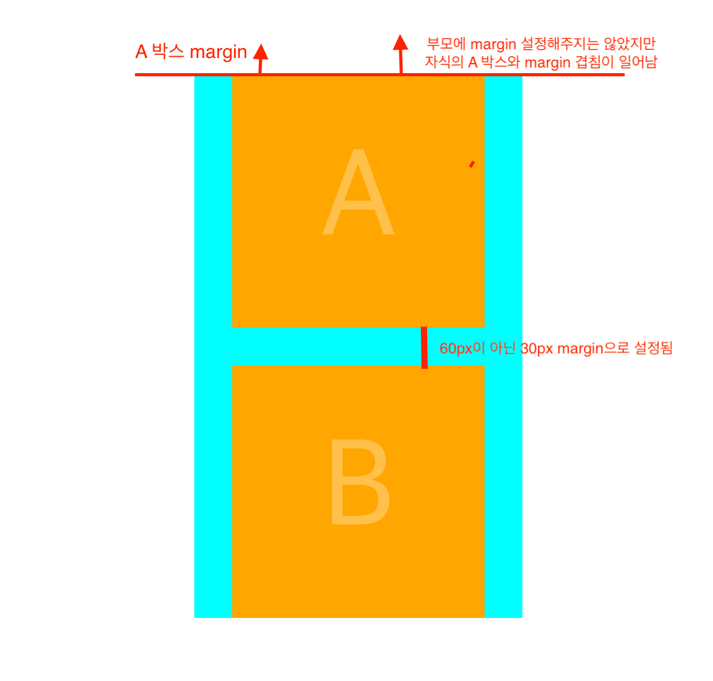
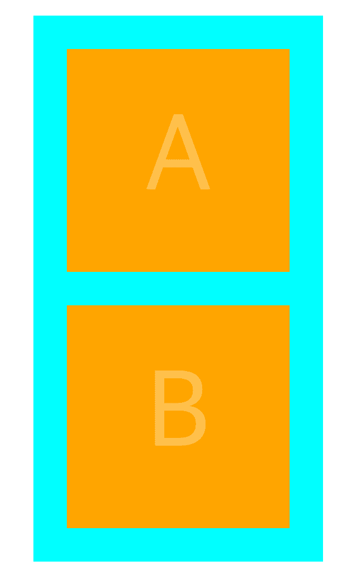
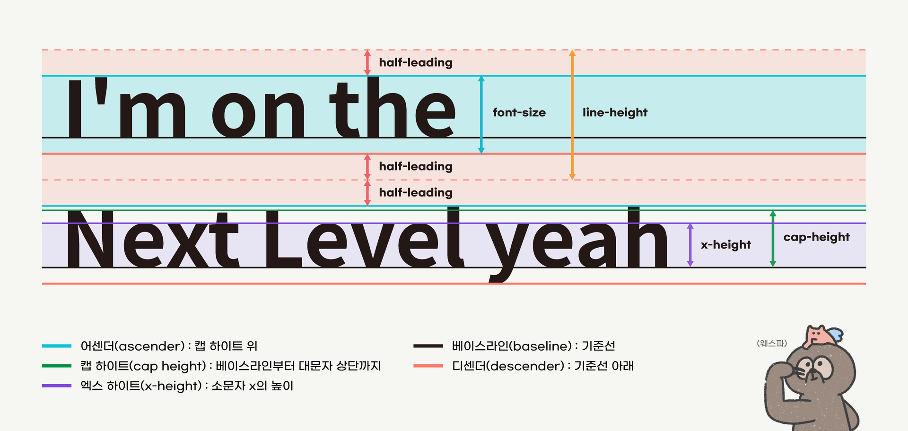

# CSS 기초

## 목차

- [속성마다 다른 auto](#속성마다-다른-auto❗️)
  - [Width, Height](#width-height)
  - [블럭 요소 중 하나인 \<div>](#블럭-요소-중-하나인-div)
  - [box-sizing의 속성값](#box-sizing의-속성값)
- [inline elements vs block-level elements](#inline-elements-vs-block-level-elements)
  - [inline elements](#inline-elements)
  - [상속](#상속)
- [Cascading](#cascading)
- [margin 병합 현상](#margin-병합-현상)
  - [margin 병합 이해하기](#margin-병합-이해하기)
- [CSS 적용하기](#css-적용하기)
  - [다중 스타일시트](#다중-스타일시트)

## 속성마다 다른 auto❗️

### Width, Height

```css
div {
  background-color: orange;
  width: auto; /* with 속성의 initial value(초깃값) <- 부모 기준 */
  height: auto; /* height 속성의 initial value(초깃값) <- 자식 기준 */
}
```

- (콘텐츠가 있을 때) div 요소는 어떻게 너비를 가질 수 있을까?
  - `width` 속성은 초깃값(initial value)으로 `auto`이기 때문에 최대너비를 가질 수 있다.

#### `width 속성의 초깃값 auto`, 그 의미는?

- <b>브라우저가 계산한</b> 즉, `margin`이나 `padding`, `border`들을 고려하여 <b>유연하게</b> 부모가 제공하는 콘텐츠 영역 최대너비만큼 가득찬다.
- `100%`와 차이는?
  - 부모가 제공하는 콘텐츠 영역 최대너비만큼 가득차지만 이는 <b>단순히 계산된 고정픽셀값</b>이다.
  - 따라서 `margin`이나 `padding`, `border` 값을 지정해주면 부모 요소를 벗어나버릴 수가 있다.
- `width: initial`: width를 초기화했다는 의미로 `auto` 값을 가진다. 좀 더 명시적임!

#### `height 속성의 초깃값 auto`, 그 의미는?

- 자식(자신)이 가지는 콘텐츠 높이만큼 <b>유연하게</b> 가진다.
- 즉, `width: auto`와는 다르게 자식이 기준이 된다.

### box-sizing의 속성값

- 요소의 너비와 높이를 계산하는 방법 지정

#### contenxt-box

- box-sizing 속성의 `initial value`
- `padding`이나 `border`의 값을 지정해주면 그 값의 두 배만큼 너비나 높이가 커진다!
  - 양쪽으로 커지기 때문에!!

#### border-box

- 테두리(`border`)와 안쪽 여백(`padding`)의 크기도 요소의 크기(width, height)로 고려하여 포함한다.
- 따라서 `padding`이나 `border`의 값을 지정해주면 자신(자식)이 가지는 크기를 벗어나지 않고
- <b>그 안에서 값이 설정된다.</b>

### 블럭 요소 중 하나인 \<div>

- 한 줄 전체를 다 차지하는 개념이다.
  - 따라서 아래 예시처럼 wow 박스가 한 줄에 배치되지 않는다.
- div 요소에 200x200 크기를 줬는데 한 줄 전체를 차지? 나머지 공간은?
  - `사용 가능한 공간`으로 밑에서 이를 활용한 예제가 나온다.

```html
<head>
  <style>
    div {
      background-color: orange;
      width: 200px;
      height: 200px;
    }
  </style>
</head>
<body>
  <div>wow</div>
  <div>wow</div>
</body>
```

```
 -----------------------------------------------------
| wow     |
|         |            사용 가능한 공강
|         |
 -----------------------------------------------------
| wow     |
|         |            사용 가능한 공간
|         |
------------------------------------------------------
```

#### 사용가능한 공간

- `margin-left: auto`: 왼쪽으로 사용가능한 공간을 취하기 때문에 wow박스는 오른쪽에!
  ```
  -----------------------------------------------------
                                             | wow     |
                  사용 가능한 공강               |         |
                                             |         |
  -----------------------------------------------------
  ```
- `margin-right: auto`: 오른쪽으로 사용가능한 공간을 취하기 때문에 wow박스는 왼쪽에!
  ```
   -----------------------------------------------------
  | wow     |
  |         |            사용 가능한 공간
  |         |
   ------------------------------------------------------
  ```
- `margin: 0 auto`: 사용가능한 공간을 좌우로 균등하게 배분해 wow 박스가 가운데로 온다.
  ```
   -----------------------------------------------------
                       | wow     |
     사용 가능한 공간 / 2  |         |   사용 가능한 공간 / 2
                       |         |
   ------------------------------------------------------
  ```

#### margin: auto auto 안되는 이유

- [관련 내용](https://www.w3.org/TR/CSS21/visudet.html#inline-replaced-height)
  - If `margin-top`, or `margin-bottom`are `auto`, their used value is 0.

## inline elements vs block-level elements

- [inline elements vs block-level elements](https://www.w3schools.com/html/html_blocks.asp)

### inline elements

- 내부에 있는 텍스트, 이미지가 해당
- <b>baseline</b>라는 것 위에 존재
  ```
  <header 공간> (text-align: center)
    <p 공간> (block element)
                o <- p 요소의 텍스트(inline element)
    --------------------------- (baseline)
    </p 공간>
  </header 공간>
  ```
- `margin: auto` vs `text-align`

  - `margin: auto`: 블럭요소 가운데 정렬
  - `text-align: center`: 인라인 요소 가운데 정렬
  - h1 자체는 block 요소라서 h1의 width를 가운데로 옮길려면 margin: auto로 해야하고,
  - 그 안에 텍스트 노드는 inline 요소로 text-align: center로 해줘야 한다.
    

#### img 가운데 정렬

```css
img {
  margin: 0 auto; /* X */
  text-align: center; /* X */
}
```

- 어떻게 가운데 정렬?
  - img 태그는 inline도 block-level도 아니기 때문에 그 상위 요소에 `text-align: center`를 적용해야 가운데 정렬이 가능하다!

### 상속

- 부모에게 지정한 값이 자식으로 그대로 전파되는 것!
  - 위 header 클래스에 `text-align: center`를 설정해줬을 때 p, h1 요소에도 상속돼서 적용된다.
- 프로퍼티와 그 값이 그대로 넘어가기 때문에 되는 프로퍼티인지 잘 확인해야 한다!
  - `background-color`, `width` 같은 경우는 안된다. 더 알고 싶으면 검색!
  - 그리고 자식 요소에 같은 프로퍼티가 있으면 자식의 것으로 적용된다.

## Cascading

- `cascading`은 '폭포, 위에서 아래로 쏟아지는'이라는 뜻을 가진 단어이다. 그리고 `cascading`은 css에서 Cascading Style Sheet의 약자로 가장 중요한 스타일 적용 규칙이기도 한다.
- `cascading`은 `스타일 우선순위`, `스타일 상속`이라는 두 가지의 원칙을 통해 어떤 요소에 스타일을 적용할지 결정한다.

### 선택자 우선순위

- CSS 파일 안에서 사용되는 선택자 우선순위에는 3가지 원칙이 있다.
  - `후자 우선의 원칙`
  - `명시도(구체성)의 원칙`
  - `중요성의 원칙`

#### 후자 우선의 원칙

```css
p {
  color: red;
  font-size: 20px;
}

p {
  color: green;
}
```

- 위 코드에서 동일한 선택자가 연속으로 사용된 것을 확인할 수 있고 `후자 우선의 원칙`에 의해 두 번째 타입선택자의 color 값으로 덮어씌워진다.

#### 명시도(Specificity)의 원칙

```css
p.color-red {
  color: red;
  font-size: 20px;
}

p {
  color: green;
}
```

- 한 선택자가 다른 선택자보다 더 구체적으로 작성되었다면 구체적인 선택자를 우선으로 선택하는 원칙
  - 위 코드에서 선택자는 둘 다 같은 p 태그를 가리키고 있지만 첫 번째 선택자가 두 번째 보다 더 구체적이기 때문에 첫 번째 선택자의 스타일이 적용된다.
- **`가중치`**
  - 명시도의 원칙은 가중치 즉, **어떤 선택자가 더 구체적인가?**를 판단할 때 가중치를 기준으로 판단한다는 의미이다.
  - 아래 코드와 같이 id와 class가 동시에 있을 경우 `id > class > 타입` 순으로 style 적용이 된다.
    ```css
    h1 {
      color: red;
    }
    .yellowgreen {
      color: yellowgreen;
    }
    #fourth {
      color: skyblue;
    }
    ```
- **`우선 순위 계산`**
  - inline-style: 요소의 안에 속성으로 선언되는 스타일이다. 1000 점의 가중치를 가진다.
  - id 선택자: 100점의 가중치를 가진다.
  - class, 가상클래스, 속성 선택자: 10점의 가중치를 가진다.
  - 타입, 가상요소 선택자: 1점의 가중치를 가진다.
  - 전체선택자(Universal Selector)는 무시된다.
  - 단, 자리올림이 되지 않는 것을 주의! 예를 들어, 타입선택자로 13점의 점수를 얻어도, 클래스가 가지는 10점을 넘지못한다.
- 우선 순위 계산

```css
h1 {
  color: blue; /* 0001점 */
}
section h1 {
  color: red; /* 0002점 */
}

.sector {
  color: blue: /* 0010점 */
}
section .sector {
  color: red; /* 0011점 */
}

#one {
  color: blue; /* 0100점 */
}
section .sector #one {
  color: red; /* 0111점 */
}
```

#### 중요성의 원칙

- `!important`: 절대적인 우선순위. 가중치 점수를 무시하고 무조건적인 우선 순위를 가진다. 쉬운 방법이지만 우선 순위 계산을 어렵게 만들기 때문에 인라인 스타일을 덮어 써야하는 등의 불가피한 상황이 아니라면 사용하지 않는 것이 좋다. 나쁜 습관이다.

## margin 병합 현상

```html
<head>
  <style>
    .wrapper {
      background-color: antiquewhite;
      width: 300px;
      margin: 100px auto;
    }

    .animal {
      background-color: blue;
    }

    .ground {
      background-color: brown;
    }
  </style>
</head>
<body>
  <div class="wrapper">
    <!-- 윗 부분이라고 해서 꼭 header가 아님 -->
    
    <!-- 재사용성을 위해 아래 컴포넌트를 div 태그 안에 작성 -->
    <div class="ground">
      <!-- 잔디는 해당 컨텐츠에 꼭 있어야 하는 것이 아님! 그저 데코용 -> background로 설정 -->
      <h1>Fox</h1>
      <p>
        Lorem ipsum dolor sit amet, consectetuer adipiscing elit. Aenean commodo
        ligula eget dolor. Aenean massa. Cum sociis natoque penatibus et magnis
        dis parturient montes, nascetur ridiculus mus. Donec quam felis,
        ultricies nec
      </p>
    </div>
  </div>
</body>
```


위 코드를 브라우저에서 코드를 실행하면 아래와 같은 결과가 나온다.
<details>
  <summary>animals 결과</summary>

  
</details>

- 위 여우 이미지의 마진과 h1의 마진부분이 병합되는 현상이 일어난다.
  - 즉, **block-level 엘리먼트 사이들의 일어나는 마진은 병합되도록 설정되어 있다.**
  - 근데 `<h1>Fox</h1>`는 div.ground 태그안에 있는데 그 안에서 margin 안일어나나?
  - 그리고 ground 클래스 밖에 margin이 일어나는 이유는???

### margin 병합 이해하기

```html
<head>
  <style>
    .wrapper {
      background-color: aqua;
      margin: 100px auto;
      width: 260px;
      /* border: 1px solid transparent; */
      /* padding: 1px; */
      /* display: flow-root; */
      /* overflow: hidden */
    }
    /*
    .wrapper::before,
    .wrapper::after {
      content: ' ';
      display: table;
    }
    */
    .box {
      font-size: 100px;
      text-align: center;
      line-height: 200px;
      background-color: orange;
      color: rgba(255, 255, 255, 0.3);
      width: 200px;
      height: 200px;
      margin: 30px;
    }
  </style>
</head>
<body>
  <div class="wrapper">
    <div class="box">A</div>
    <div class="box">B</div>
  </div>
  <body></body>
</body>
```

- A와 B 박스가 마진 병합 현상으로 인해 위아래로 margin 60px이 돼야하는데 30px인 것을 확인할 수 있다.
- 그리고 부모의 자식의 margin 병합도 일어나 아래 이미지 같은 현상이 일어난다.

#### 부모 자식 간의 마진 병합 해결 방법

- `border`, `padding`을 속성을 줘서 부모와 자식의 마진 병합 해결
- `display: flow-root;` 속성을 설정해 해결할 수 있지만 IE에서 지원하지 않는다는 문제점이 있다.
- `overflow: hidden` 속성을 줘서 원래의 용도가 아닌 마진 병합 해결하는데 사용할 수 있다.
  - `Block Formatting Context`라는 요소가 내부에 있어 독립적인 영역이 돼서 해결 가능
  - [Block Formatting Context 자세히 알기](https://developer.mozilla.org/ko/docs/Web/Guide/CSS/Block_formatting_context)
  - 대신 A, B 박스에 `box-shadowing` 프로퍼티를 설정하게 되면 짤리게 되는 문제가 생긴다.
- `<table>`로 해결하기
  ```html
  <div class="wrapper">
    <table></table>
    <div class="box">A</div>
    <div class="box">B</div>
    <table></table>
  </div>
  ```
  - A와 B 박스 위아래로 `<table>` 태그를 작성해 공간은 차지않으면서 마진 겹침 현상을 해결할 수 있다.
  - 대신 올바른 마크업을 사용하는 것은 아니므로 HTML 관점에서는 올바른 상황은 아니다.
- `.wrapper::before, .wrapper::after`로 Pseudo Element로 마진 병합 해결할 수 있다.

  - css 단에서 컨텐츠를 추가해주는 개념을 활용해 마진 병합을 해결 가능
    <details>
      <summary>AB 박스 마진 병합 현상 및 해결</summary>

      
      

</details>

## CSS 적용하기

### 다중 스타일시트

```css
@import "foo.css";
```

- 위 코드처럼 `@`가 붙는 문법을 `at-rule`이라고 부른다. import만 있는 것이 아니고 아래처럼 다양한 엣룰이 있다.
  - `@charset`: 스타일시트에서사용하는 문자 인코딩을 지정한다. 문서에서 가장 먼저 선언한다.
  - `@import`: 다른 스타일 시트에서 스타일 규칙을 가져온다. @charset 바로 다음에 선언되어야 한다.
  - `@font-face`: 디바이스에 없는 폰트를 다운받아 적용할 때 사용한다.
  - `@keyframes`: 애니메이션을 만들 때 사용한다.
  - `@media`: 사용자 디바이스에 따른 스타일을 분기 처리하고자 할 때 사용한다.
  - `@supports`: 특정 CSS 속성을 브라우저가 지원하는지 확인하고 스타일을 선언하고자 할 때 사용한다.

### RESET CSS

#### 문제의 시작. 너무 많은 브라우저들. 각자 다른 스타일.

- 사파리, 크롬 등 브라우저 제작사들마다 각각 브라우저가 제공하는 요소의 기본 스타일이 모두 다르다.
- 개발자들은 디자이너에게 받은 웹디자인을 구현하기 위해 각각의 브라우저에 따라 다른 스타일을 부여해야 한다는 문제가 발생
  - 너무 비효율적인 방법이기 때문에 아래와 같은 해결방법이 나타난다.

#### 에릭 마이어의 reset CSS

- 매우 오래전부터 널리 사용된 방법. 하지만 2011년 이후로 업데이트 중단
- [해당 사이트](https://meyerweb.com/eric/tools/css/reset/)

#### normalize.css

- 노멀라이즈는 브라우저의 기본적인 스타일 속성들을 모두 제거하지 않는다.
  - 에릭 마이어는 기존 스타일을 모두 제거하는 적극적인 방법이라면, normalize는 브라우저 고유의 스타일을 존중하면서 거기에 스타일을 첨가하는, 좀 더 부드러운 방법으로 생각하면 된다.
- [해당 사이트](https://necolas.github.io/normalize.css/)

#### CSS Remedy

- 아직 프로젝트 진행중이며, 만약 CSSWG에서 CSS를 제작하는 사람들의 입장이라면, 어떤식으로 브라우저에게 기본 스타일을 주게 될 까 라는 생각에서 출발한 차세대 CSS reset 프로젝트
  - 때문에 단순히 스타일만 생각하는 것이 아닌, 하위 브라우저 호환 걱정없이 CSS가 브라우저에서 효율적으로 작동하도록 하는 것이 목표!
- [해당 사이트](https://github.com/jensimmons/cssremedy)

### 벤더프리픽스(Vendor-Prefix)

| 벤더 프리픽스 | 웹 브라우저                                                                 | 예                           |
| ------------- | --------------------------------------------------------------------------- | ---------------------------- |
| -webkit-      | 크롬, 안드로이드, 사파리, ios 기반 파이어폭스, 오페라 등 웹킷 기반 브라우저 | -webkit-transition: all .5s; |
| -moz-         | 파이어폭스 브라우저                                                         | -moz-transition: all .5s;    |
| -ms-          | 마이크로소프트 인터넷 익스플로어, 레거시 엣지                               | -ms-transition: all .5s;     |
| -o-           | 레거시 오페라 브라우저                                                      | -o-transition: all .5s;      |

- 벤더(브라우저 제조사)와 프리픽스(접두어)의 합성어
- 아직 비표준이거나 실험적인 CSS 속성을 특정 브라우저에서 실행할 수 있도록 CSS 속성 앞에 브라우저 제조사만의 접두어(prefix)를 붙이는 문법을 의미한다.
  ```css
  -webkit-transition: all 4s ease;
  -moz-transition: all 4s ease;
  -ms-transition: all 4s ease;
  -o-transition: all 4s ease;
  transition: all 4s ease;
  ```
  - 벤더 프리픽스는 줄어 들고 있지만 새로운 CSS 기능들은 개발되고 있기 때문에 아직까지 사용해야하는 벤더 프리픽스들이 존재한다.
  - 그리고 크로스 브라우징을 위해 레거시 브라우저들을 지원해야한다는 점도 있다!
  - [벤더 프리픽서 자동화를 위한 사이트](https://autoprefixer.github.io/) 및 VS Code 익스텐션 `Autoprefixer`를 이용할 수 있다.

#### 웹킷 기반 브라우저?

웹킷(Webkit)은 브라우저가 HTML, CSS를 화면에 그려줄때 사용하는 렌더링 엔진이다.  
크롬, 안드로이드, 사파리, ios 기반 파이어폭스 등 많은 브라우저들이 사용했다.  
현재 크롬, 안드로이드, 오페라, 마이크로소프트 엣지 브라우저 등은 **Blink** 엔진으로 전환되었다. 참고로 Blink 엔진은 vendor-prefix가 존재하지 않는다.

## CSS Box Model

### 박스의 구성

- **콘텐츠(content) 박스**: 요소의 콘텐츠가 표시되는 영역으로 넓이는 `width` 그리고 높이는 `height`와 같은 속성을 사용해서 설정할 수 있다.
- **패딩(padding) 박스**: 패딩은 콘텐츠와 테두리 사이의 공간이다. 패딩의 크기는 `padding`과 관련 속성을 사용해 제어할 수 있다.
- **보더(border) 박스**: 보더 박스는 콘텐츠와 패딩을 둘러싸는 테두리이다. 보더의 크기와 스타일은 `border`와 관련 속성을 사용하여 제어할 수 있다.
- **마진(margin) 박스**: 마진은 보더 바깥 쪽 영역으로 요소와 요소 사이의 공백 역할을 한다. 마진 박스의 크기는 `margin`과 관련 속성을 사용하여 제어될 수 있따.

### 박스의 유형

#### 블록 박스

- 사용 가능 공간을 양 옆으로 100% 사용하며 사용하지 못하는 공간은 마진 영역으로 채운다. 상위 콘테이너에서 사용 가능 공간을 채운다.
- `width`와 `height`속성을 사용하여 스타일을 컨트롤할 수 있다.

#### 인라인 박스

- 기본적으로 컨텐츠 박스만큼의 크기만 가진다. 때문에 새 줄로 행을 바꾸지 않는다.
- `width`와 `height` 속성을 사용할 수 없다.
- `padding`과 `border` 속성을 사용할 수 있지만 마진 속성은 좌우만 조절 가능

### 박스의 유형을 결정하는 속성: display

`display` 속성은 박스의 성질을 지정하여 다른 박스들과 어떤 방식으로 우치가 배치될지 결정한다.  
display 속성을 크게 외부의 다른 형태, 부모 박스들과의 배치에 영향을 미치는 **외부 디스플레이 타입**과 내부 자식 박스들의 배치에 영향을 미치는 **내부 디스플레이 타입**으로 크게 나눌 수 있다.

- **inline**: 인라인 박스로 박스의 유형을 결정한다.
- **block**: 블록 박스로 박스의 유형을 결정한다.
- **inline-block**: inline처럼 한 줄에 여러 요소가 존재할 수 있다. block처럼 `width`, `height`, `margin`, `padding` 등 모든 값을 지정할 수 있다.
  - **inline** 속성의 특징과 **block** 속성의 특징이 함께 존재하는 박스

### 표준 CSS 박스 모델(Standard CSS Box Model)

### width, height

- 표준 CSS 박스모델에서는 블록 박스인 경우 width, height 값을 통해 **content box**의 크기를 제어한다.
  - 부모의 높이가 `auto`인 경우 자식의 높이를 `%`로 줄 경우 적용되지 않는다.ㄴ

#### border

- **border-width** - 선의 두께와 관련된 속성
  - 길이 지정 - 속성 값을 px과 같은 단위로 직접 지정한다.
  - medium - 키워드, 중간 굵기로 표시된다.
  - thin - 키워드, 얇은 실선으로 표시된다.
  - thick - 키워드, 굵은 선으로 표시된다.
- **border-style** - 선의 모양과 관련된 속성
  - none - 선을 없앱
  - solid - 직성
  - dotted - 점선
  - dashed - 파선으로 바느질선과 같은 모양
  - double - 평행한 이중선
  - groove - 테두리가 오목하게 안쪽으로 파인 선
  - ridge - 테두리가 볼록하게 나온 입체감이 있는 선, groove의 반대
  - inset - 요소가 전체적으로 안으로 들어가 보이는 형태
  - outset - 요소가 튀어나온 것처럼 보인다. inset의 반대
- **border-color** - 선의 색깔과 관련된 속성

#### padding, margin

- **padding** - 패딩 박스 영역의 스타일을 정의
- **margin** - 마진 박스 영역의 스타일을 정의

### 대체 CSS 박스 모델(Alternative CSS Box Model)

표준 CSS 박스모델에서 요소의 전체적인 크기는 컨텐츠 박스 + 보더 박스 + 패딩 박스의 너비와 높이 값을 모두 더행 정해진다. 하지만 박스의 실제 크기를 얻기 위해 테두리와 패딩을 추가하는 것이 불편하고 귀찮을 수 있어 **대체 박스 모델**이 도입되었다. 이 모델을 사용한다면 `width`는 페이지에서 차지하는 박스 너비가 되고, `height`는 박스의 높이가 된다.

#### box-sizing

```css
h1 {
  box-sizing: border-box;
  /* box-sizing: content-box; --> box-sizing의 기본값으로 표준 박스 모델에서 사용된다. */
}
```

```css
* {
  margin: 0;
}
h1 {
  width: 100px;
  height: 30px;
  border: 3px solid #228b22;
  padding: 10px;
}
/*
  h1 요소의 넓이: 3 + 3 + 10 + 10 + 100 = 126
  h1 요소의 높이: 3 + 3 + 10 + 10 + 30 = 56
*/
```

```css
* {
  margin: 0;
}
h1 {
  width: 100px;
  height: 30px;
  border: 3px solid #228b22;
  padding: 10px;
  box-sizing: border-box;
}
/*
  h1 요소의 넓이: 3 + 3 + 10 + 10 + 74 = 100
  h1 요소의 높이: 3 + 3 + 10 + 10 + 4 = 30
*/
```

## CSS declarations

### 단위

#### 단위의 분류

- 절대 길이 단위: cm, mm, px 등
- 상대 길이 단위: em, rem, vw, vh, % 등

| 단위           | 설명                                                                                 |
| -------------- | ------------------------------------------------------------------------------------ |
| 절대 길이 단위 |                                                                                      |
| px             | CSS에서 많이 쓰이는 기본 단위로, 사용자가 선언한 고정된 크기 그대로를 화면에 그린다. |
| em             | 배수 단위. 부모 요소의 글자 크기를 기준점으로 한다.                                  |
| %              | 부모 요소를 기준으로 하는 백분율 단위                                                |
| rem            | root em. 최상위(`<html>`)의 글자 크기를 기준점으로 하는 배수 단위이다.               |
| vw             | 화면 넓이를 기준으로 하는 백분율 단위                                                |
| vh             | 화면 높이를 기준으로 하는 백분율 단위}                                               |
| vmin           | 화면의 넓이와 높이 중 작은 값을 기준으로 하는 백분율 단위                            |
| vmax           | 화면의 넓이와 높이 중 큰 값을 기준으로 하는 백분율 단위                              |
| ex             | 현재 폰트의 x-height 값. 즉, 현재 폰트의 소문자 x의 높이값을 기준으로 한 백분율 단위 |

#### em

(부모의 크기값 \* 자식의 em 값) = 자식이 가지게 될 크기 값

- em에서의 값 1은 100%이다.

#### %

### overflow

**overflow** 속성은 첫 번째 `overflow-x`, 두 번째 값은 `overflow-y`를 지정한다. 하나만 사용하면 지정한 값을 양 축 모두에게 적용하는 축양형이 된다.

#### overflow 중요 속성

- **visible** - overflow 속성의 기본값으로 콘텐츠를 자르지 않는다.
- **hidden** - 콘텐츠를 요소의 크기만큼 맞추기 위해 잘라낸다. 스크롤바 제공 X
  - float이나 margin 겹침 현상 등에서 자식 요소의 넓이나 높이를 포함시키기 위해서도 많이 사용
  - 관련 포털 검색 키워드: **overflow hidden을 사용한 자식선택자**
- **scoll** - 콘텐츠를 요소의 크기만큼 맞추기 위해 잘라낸다. 스크롤바 제공 O

- Daum과 Naver에 활용 사례

```html
<!DOCTYPE html>
<html lang="ko">
  <head>
    <style>
      .background {
        background-color: red;
      }

      /* naver 스타일 */
      .blind {
        position: absolute;
        clip: rect(0 0 0 0);
        width: 1px;
        height: 1px;
        margin: -1px;
        overflow: hidden;
      }

      /* daum 스타일 */
      .screen_out {
        overflow: hidden;
        position: absolute;
        width: 0;
        height: 0;
        line-height: 0;
        text-indent: -9999px;
      }

      .display_none {
        display: none;
      }

      .visibility_hidden {
        visibility: hidden;
      }
    </style>
  </head>
  <body>
    <h1>hello world</h1>
    <div class="blind background">naver</div>
    <div class="screen_out background">daum</div>
    <div class="display_none background">display none</div>
    <!-- 영역은 차지하고 있습니다. -->
    <div class="visibility_hidden background">visibility hidden</div>
  </body>
</html>
```

```css
.blind {
  /* 정상적인 흐름에서 항목 제거 */
  position: absolute;

  /*요소 숨김
    top과 bottom, left와 right가 같은 값이면 요소를 숨김*/
  clip: rect(0 0 0 0);

  /* 가능한 가장 작은 크기로 설정.
    일부 스크린 리더는 높이와 너비가 0인 요소를 무시 */
  width: 1px;
  height: 1px;

  /* IE 구버전에서 인식을 못하는 경우가 있음 */
  margin: -1px;

  /* 크기 조정 후 넘치는 내용 숨기기 */
  overflow: hidden;

  /* CSS 위치 지정 및 음수 텍스트 들여쓰기 기술(ex) text-indent:-9999px)과 달리
     "클립 패턴"은 RTL(오른쪽에서 왼쪽) 언어에서도 작동.*/
}
```

### background-image

background-image 속성은 html 요소 뒤에 이미지를 배치할 때 사용한다.

- background-image: url을 이용해 이미지의 주소에서 이미지를 불러온다.
- background-color: 요소의 배경 색을 지정한다.
- background-repeat: 배경이미지를 어떻게 반복할것인지 지정한다.
  - repeat: 반복
  - no-repeat: 반복 없음
  - repeat-x: x축만 반복
  - repeat-y: y축만 반복
  - round: 이미지가 짤리지 않게, 이미지 크기 변화를 줘서 간격 없이 반복
  - space: 이미지가 짤리지 않게, 이미지 크기는 유지한채로 간격을 줘서 반복
- background-position: 배경이미지의 위치를 지정한다.
- background-size
  - cover: 이미지를 넓이와 높이에 맞게 잘라낸다.
    - 이미지가 찌그러지지 않는 한도 내에서 제일 크게 설정(잘릴 수도 있음)
  - contain: 이미지 넓이나 높이에 맞춰 자신의 이미지를 모두 넣고 반복
    - 이미지가 잘리거나 찌그러지지 않는 한도 내에서 제일 크게 설정
  - 100%: 이미지를 width와 height에 맞게 압축

#### 어느 곳에서 `img` 태그를 , 어느 곳에서 `background-image`를 사용해야 하나요?

- 주로 백엔드 개발자와 협업해야 하는 공간에는 img 태그, FE 혼자 작업하는 공간에는 background-image를 사용한다.
- 스크린리더가 읽지 않아야 하는 곳에서 사용하기도 한다.

### font

- font-size: 글꼴의 크기 변경
- font-family: 글꼴 변경
- font-weight: 글꼴 굵기 변경(normal: 일반 스타일, bold: 텍스트 굵게)
- text-transform: 대문자, 소문자 표현
  - uppercase: 대문자, lowercase: 소문자, capitalize: 각 단어의 첫글자를 대문자로
- font-style: 글꼴 기울기 설정
  - normal은 일반 스타일, italic: 필기체, oblique는 기울임체
- text-align: 텍스트의 정렬 표현
  - left: 왼쪽, right: 오른쪽, center: 가운데, justify: 마지막 줄을 제외하고 양쪽으로 정렬
- text-decoration: 텍스트 장식 설정
  - none: 효과 제거, underline: 밑줄 추가

## Text

### 서체의 기준선 목록



### line-height

글자 라인의 높이를 지정하여 텍스트 라인과 라인 사이의 간격(leading)을 조정할 때 사용한다.

#### line-height의 단위

- **normal**: 기본값. 폰트의 font-family에 따른 글자의 기본 높이이다.
  - 사용하는 font-family에 따라 기본 line-height 값이 다르다는 것에 유의해야 한다.
- number: 숫자로 값을 설정할 수 있다.
  - 1은 font-size 값 만큼의 라인 높이를 의미한다.
  - 2는 font-size 값의 두 배를 의미하므로 font-size가 16px이면 해당 inline의 높이는 총 32px가 된다.
  - 소수점까지 지원한다.
- px, em, %: 해당하는 유닛 단위에 맞춰 라인의 높이가 설정된다.
  - px: px로 고정된 값을 적용한다. 폰트의 사이즈가 변할 경우를 대비하지 못하기 때문에 잘 사용하지 않는다.
  - em: 부모 요소의 font-size에 비례한 값을 적용한다. px과 마찬가지로 요소의 폰트사이즈가 변하면 대비할 수 없다.
  - %: 요소 자신의 폰트 사이즈를 기준으로 값을 설정한다.

```html
<!DOCTYPE html>
<html lang="ko">
  <head>
    <meta charset="UTF-8" />
    <meta http-equiv="X-UA-Compatible" content="IE=edge" />
    <meta name="viewport" content="width=device-width, initial-scale=1.0" />
    <title>line-height</title>
    <style>
      .container {
        width: 300px;
        height: 300px;
        font-size: 16px;
        border: solid 1px black;
        /* 1. 고정 값으로 주었을 경우 : two, three 확인 */
        /* line-height: 10px; */

        /* 2. em으로 주었을 경우 : 역시나 two, three 확인, 더 큰 font를 자식 요소에서 사용했을 경우 UI가 깨짐 */
        /* line-height: 1em; */

        /* 3. 1값을 사용했을 경우 개발자 도구 열어서 확인해보면 contents 높이가 32px 그러나 만약 line-height가 없다면 42.86! leading 영역이 폰트의 위 아래로 존재하기 때문, line-height 1은 이 leading 영역을 없앰(폰트 높이에 딱 붙게됨), leading 영역까지 포함하여 nomal */
        /* line-height: 1; */
      }
      .one {
        font-size: 10px;
        border: solid 1px black;
      }
      .two {
        font-size: 20px;
        border: solid 1px black;
      }
      .three {
        font-size: 30px;
        border: solid 1px black;
      }
    </style>
  </head>
  <body>
    <h1>hello world</h1>
    <div class="container">
      <div class="one">hello world</div>
      <div class="two">hello world</div>
      <div class="three">hello world</div>
    </div>
  </body>
</html>
```
