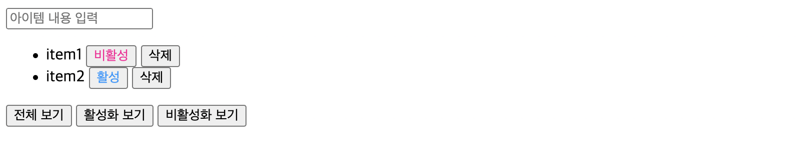

# Vanilla JavaScript로 웹 컴포넌트 만들기

> 출처: [Vanilla JavaScript로 웹 컴포넌트 만들기](https://junilhwang.github.io/TIL/Javascript/Design/Vanilla-JS-Component/#_1-%E1%84%89%E1%85%A1%E1%86%BC%E1%84%90%E1%85%A2%E1%84%80%E1%85%AA%E1%86%AB%E1%84%85%E1%85%B5%E1%84%8B%E1%85%B4-%E1%84%90%E1%85%A1%E1%86%AB%E1%84%89%E1%85%A2%E1%86%BC)

## 컴포넌트

현재 웹 어플리케이션들은 **컴포넌트 단위**로 설계되고 개발된다. 그리고 컴포넌트마다 컴포넌트를 렌더링할 때 필요한 상태를 관리하게 되었으며, `Proxy` 혹은 `Observer Pattern` 등을 이용하여 이를 구현한다.

## set - setState - render

```html
<div id="app"></div>
<script>
  const $app = document.querySelector("#app");

  let state = {
    items: ["item1", "item2", "item3", "item4"],
  };

  const render = () => {
    const { items } = state;
    $app.innerHTML = `
        <ul>
          ${items.map((item) => `<li>${item}</li>`).join("")}
        </ul>
        <button id="append">추가</button>
      `;
    document.querySelector("#append").addEventListener("click", () => {
      setState({ items: [...items, `item${items.length + 1}`] });
    });
  };

  const setState = (newState) => {
    console.log("newState", state, newState);
    state = { ...state, ...newState };
    render();
  };

  render();
</script>
```

- `state`가 변경되면 `render`를 실행한다.
- `state`는 `setState`로만 변경해야 한다.
- **위 코드를 실행시켜보면 버튼을 누를 때마다 `setState`가 실행되어 `state`가 변경되고, `render`를 실행해서 컴포넌트를 다시 렌더링한다.**
  - 즉, 이 규칙을 지키면 브라우저 출력되는 내용은 무조건 `state`에 종속되는 것이다.
  - `DOM`을 직접적으로 다룰 필요가 없어진다.

### 추상화

```html
<div id="app"></div>
<script>
  class Component {
    target;
    state;

    constructor(target) {
      this.target = target;
      this.setup();
      this.render();
    }
    setup() {}
    template() {
      return "";
    }
    render() {
      this.target.innerHTML = this.template();
      this.setEvent();
    }
    setEvent() {}
    setState(newState) {
      this.state = { ...this.state, ...newState };
      this.render();
    }
  }

  class App extends Component {
    setup() {
      this.state = { items: ["item1", "item2"] };
    }
    template() {
      const { items } = this.state;
      return `
          <ul>
            ${items.map((item) => `<li>${item}</li>`).join("")}
          </ul>
          <button>추가</button>
        `;
    }
    setEvent() {
      this.target.querySelector("button").addEventListener("click", () => {
        const { items } = this.state;
        this.setState({ items: [...items, `item${items.length + 1}`] });
      });
    }
  }

  new App(document.querySelector("#app"));
</script>
```

- 컴포넌트 클래스를 작성함으로써 조금 더 유연하게 만들 수 있고, 컴포넌트 코드의 사용 방법을 강제하기 때문에 유지보수하고 관리할 때 매우 이롭다.

### 모듈화

```sh
- index.html
- 📁 src            # ES Module의 entry file
  - app.js
  - 📁 components   # Component 역할을 하는 것들
    - Items.js
  - 📁 core         # 구현에 필요한 코어들
    - Component.js
```

#### index.html

```html
<!DOCTYPE html>
<html lang="ko">
  <head>
    <meta charset="UTF-8" />
    <meta http-equiv="X-UA-Compatible" content="IE=edge" />
    <meta name="viewport" content="width=device-width, initial-scale=1.0" />
    <title>Simple Component</title>
  </head>
  <body>
    <div id="app"></div>
    <script src="./src/app.js" type="module"></script>
  </body>
</html>
```

#### src/app.js

```js
import Items from "./components/Item.js";

class App {
  constructor() {
    const $app = document.querySelector("#app");
    new Items($app);
  }
}

new App();
```

#### src/components/Items.js

```js
import Component from "../core/Component.js";

export default class Items extends Component {
  setup() {
    this.state = { items: ["item1", "item2"] };
  }

  template() {
    const { items } = this.state;
    return `
      <ul>
        ${items.map((item) => `<li>${item}</li>`).join("")}
      </ul>
      <button>추가</button>
    `;
  }

  setEvent() {
    this.target.querySelector("button").addEventListener("click", () => {
      const { items } = this.state;
      this.setState({ items: [...items, `item${items.length + 1}`] });
    });
  }
}
```

#### src/core/Components.js

```js
export default class Component {
  target;
  state;
  constructor(target) {
    this.target = target;
    this.setup();
    this.render();
  }
  setup() {}
  template() {
    return "";
  }
  render() {
    this.target.innerHTML = this.template();
    this.setEvent();
  }
  setEvent() {}
  setState(newState) {
    this.state = { ...this.state, ...newState };
    this.render();
  }
}
```

## 불편함 감지

### 불편함 감지하기

앞에서 작성한 코드를 사용하면 `render`를 실행할 때마다 이벤트가 새로 등록된다.  
추가로 반복적인 요소에 대해 각각 이벤트를 등록해야 할 땐 중복되는 작업이 발생한다.

```js
// 각 아이템에 대한 "삭제" 기능을 추가하는 경우
import Component from "../core/Component.js";

export default class Items extends Component {
  setup() {
    this.state = { items: ["item1", "item2"] };
  }

  template() {
    const { items } = this.state;
    return `
      <ul>
        ${items
          .map(
            (item, key) => `
          <li>
            ${item}
            <button class="deleteBtn" data-index="${key}">삭제</button>
          </li>
        `
          )
          .join("")}
      </ul>
      <button class="addBtn">추가</button>
    `;
  }

  setEvent() {
    this.target.querySelector(".addBtn").addEventListener("click", () => {
      const { items } = this.state;
      this.setState({ items: [...items, `item${items.length + 1}`] });
    });

    this.target.querySelectorAll(".deleteBtn").forEach((deleteBtn) =>
      deleteBtn.addEventListener("click", ({ target }) => {
        const items = [...this.state.items]; // 얕은 복사 후
        items.splice(target.dataset.index, 1); // 해당 data-index를 가진 item 제거
        this.setState({ items }); // 상태 변화
      })
    );
  }
}
```

### 이벤트 버블링

- 이벤트 버블링을 사용하여 직관적으로 처리할 수 있다.
  - 기존의 `setState`는 `render`를 할 때마다 실행하도록 작성되어 있기 때문에, `core/Components.js`에 `라이프 사이클`을 변경해야 한다.

```js
// src/components/Items.js
import Component from "../core/Component.js";

export default class Items extends Component {
  setup() {
    this.state = { items: ["item1", "item2"] };
  }

  template() {
    const { items } = this.state;
    return `
      <ul>
        ${items
          .map(
            (item, key) => `
          <li>
            ${item}
            <button class="deleteBtn" data-index="${key}">삭제</button>
          </li>
        `
          )
          .join("")}
      </ul>
      <button class="addBtn">추가</button>
    `;
  }

  setEvent() {
    // 모든 이벤트를 this.target에 등록하여 사용
    this.target.addEventListener("click", ({ target }) => {
      const items = [...this.state.items];

      if (target.classList.contains("addBtn")) {
        this.setState({ items: [...items, `item${items.length + 1}`] });
      }

      if (target.classList.contains("deleteBtn")) {
        items.splice(target.dataset.index, 1);
        this.setState({ items });
      }
    });
  }
}
```

```js
// src/core/Components.js
export default class Component {
  target;
  state;
  constructor(target) {
    this.target = target;
    this.setup();
    this.render();
    this.setEvent(); // constructor에서 한 번만 실행한다.
  }
  setup() {}
  template() {
    return "";
  }
  render() {
    this.target.innerHTML = this.template();
  }
  setEvent() {}
  setState(newState) {
    this.state = { ...this.state, ...newState };
    this.render();
  }
}
```

### 이벤트 버블링 추상화

이벤트 버블링을 통한 등록 과정을 메서드로 만들어서 사용하기

```js
// src/components/Items.js
import Component from "../core/Component.js";

export default class Items extends Component {
  setup() {
    this.state = { items: ["item1", "item2"] };
  }

  template() {
    /* 생략 */
  }

  setEvent() {
    this.addEvent("click", ".addBtn", ({ target }) => {
      const { items } = this.state;
      this.setState({ items: [...items, `item${items.length + 1}`] });
    });

    this.addEvent("click", ".deleteBtn", ({ target }) => {
      const items = [...this.state.items];
      items.splice(target.dataset.index, 1);
      this.setState({ items });
    });
  }
}
```

```js
// src/core/Component.js
export default class Component {
  target;
  state;
  constructor(target) {
    this.target = target;
    this.setup();
    this.render();
    this.setEvent(); // constructor에서 한 번만 실행한다.
  }
  setup() {}
  template() {
    return "";
  }
  render() {
    this.target.innerHTML = this.template();
  }
  setEvent() {}
  setState(newState) {
    this.state = { ...this.state, ...newState };
    this.render();
  }

  addEvent(eventType, selector, callback) {
    const children = [...this.target.querySelectorAll(selector)];
    // selector에 명시한 것보다 더 하위 요소가 선택되는 경우가 있을 땐 closest를 이용하여 처리한다.
    const isTarget = (target) =>
      children.includes(target) || target.closest(selector);

    this.target.addEventListener(eventType, (event) => {
      if (!isTarget(event.target)) return false;
      callback(event);
    });
  }
}
```

## 컴포넌트 분할하기

### 기능 추가

- 현재까지의 코드는 컴포넌트를 분리할 필요가 없지만 `Items` 컴포넌트에 `toggle`, `filter` 등의 기능을 추가했을 때 아래의 코드처럼 유지 보수가 어렵게 된다.
  - Items 컨포넌트가 무언가 많은 일을 하게 되면 코드를 관리하기 힘들고,
  - 컴포넌트라는 이름이 무색하게 컴포넌트 단위로 활용할 수 없는 상태가 됐다.
- 기본적으로 컴포넌트는 `재활용`이 목적이다.
  - 그러기 위해서는 하나의 컴포넌트가 최대한 작은 단위의 일을 하도록 만들어야 한다.

```js
import Component from "../core/Component.js";

export default class Items extends Component {
  get filteredItems() {
    const { isFilter, items } = this.state;
    return items.filter(
      ({ active }) =>
        (isFilter === 1 && active) ||
        (isFilter === 2 && !active) ||
        isFilter === 0
    );
  }

  setup() {
    this.state = {
      isFilter: 0,
      items: [
        {
          seq: 1,
          contents: "item1",
          active: false,
        },
        {
          seq: 2,
          contents: "item2",
          active: true,
        },
      ],
    };
  }

  template() {
    return `
      <header>
        <input type="text" class="appender" placeholder="아이템 내용 입력" />
      </header>
      <main>
        <ul>
          ${this.filteredItems
            .map(({ contents, active, seq }) => `
              <li data-seq="${seq}">
                ${contents}
                <button class="toggleBtn" style="color: ${active ? "#09F" : "#F09"}">
                ${active ? "활성" : "비활성"}
              </button>
              <button class="deleteBtn">삭제</button>
              </li>
            `).join("")}
        </ul>
      </main>
      <footer>
        <button class="filterBtn" data-is-filter="0">전체보기</button>
        <button class="filterBtn" data-is-filter="1">활성 보기</button>
        <button class="filterBtn" data-is-filter="2">비활성 보기</button>
      </footer>
    `;
  }

  setEvent() {
    this.addEvent("keyup", ".appender", ({ key, target }) => {
      if (key !== "Enter") return;
      const { items } = this.state;
      const seq = Math.max(0, ...items.map((v) => v.seq)) + 1; // 다음 seq 구하기
      const contents = target.value;
      const active = false;
      this.setState({
        items: [...items, { seq, contents, active }],
      });
    });

    this.addEvent("click", ".deleteBtn", ({ target }) => {
      const items = [...this.state.items];
      const seq = Number(target.closest("[data-seq]").dataset.seq);
      items.splice(
        items.findIndex((v) => v.seq === seq),
        1
      );
      this.setState({ items });
    });

    this.addEvent("click", ".toggleBtn", ({ target }) => {
      const items = [...this.state.items];
      const seq = Number(target.closest("[data-seq]").dataset.seq);
      const index = items.findIndex((v) => v.seq === seq);
      items[index].active = !items[index].active; // toggle
      this.setState({ items });
    });

    this.addEvent("click", ".filterBtn", ({ target }) => {
      this.setState({ isFilter: Number(target.dataset.isFilter) });
    });
  }
}
```

### 폴더 구조

```sh
- index.html
- 📁 src
  - App.js          # main에서 App 컴포넌트를 마운트한다.
  - main.js         # js의 entry 포인트
  - 📁 components
    - ItemAppender.js
    - ItemFilter.js
    - Items.js
  - 📁 core
    - Component.js
```

- 기존의 **entry point가 app.js에서 main.js**가 되었다.
  - `App Components`를 추가했다.
  - `Items`에서 `ItemAppender`, `ItemFilter` 등을 분리했다.

### Component Core 변경

- `scr/core/Components.js`에 `props`와 `mounted`를 추가해야 한다.
  - `mounted`를 추가한 이유는 render 이후에 추가적인 기능을 수행하기 위해서다.
  - `props`는 부모 컴포넌트가 자식 컴포넌트에게 상태 혹은 메서드를 넘겨주기 위해서다.

```js
export default class Component {
  target;
  props;
  state;
  constructor(target, props) {
    this.target = target;
    this.props = props; // props 할당
    this.setup();
    this.render();
    this.setEvent(); // constructor에서 한 번만 실행한다.
  }
  setup() {}
  mounted() {}
  template() {
    return "";
  }
  render() {
    this.target.innerHTML = this.template();
    this.mounted(); // render 후에 mounted가 실행된다.
  }
  setEvent() {}
  setState(newState) {
    this.state = { ...this.state, ...newState };
    this.render();
  }

  addEvent(eventType, selector, callback) {
    const children = [...this.target.querySelectorAll(selector)];
    // selector에 명시한 것보다 더 하위 요소가 선택되는 경우가 있을 땐 closest를 이용하여 처리한다.
    const isTarget = (target) =>
      children.includes(target) || target.closest(selector);

    this.target.addEventListener(eventType, (event) => {
      if (!isTarget(event.target)) return false;
      callback(event);
    });
  }
}
```

### Entry Point 변경

* `index.html`: 기존에 `app.js`가 아닌 `main.js`를 가져온다.

```html
<!-- <script src="src/app.js" type="module"></script> -->
<script src="src/main.js" type="module"></script>
```

* `src/main.js`

```js
import App from "./App.js";

new App(document.querySelector("#app"));
```

### 컴포넌트 분할

기존의 `Items`에 존재하던 로직을 `App.js`에 넘겨주고, `Items`, `ItemAppender`, `ItemFilter` 등은 `App.js`에서 넘겨주는 로직을 사용하도록 만들어야 한다.

#### src/App.js

```js
import Component from "./core/Component.js";
import Items from "./components/Items.js";
import ItemAppender from "./components/ItemAppender.js";
import ItemFilter from "./components/ItemFilter.js";

export default class App extends Component {
  setup() {
    this.state = {
      isFilter: 0,
      items: [
        {
          seq: 1,
          contents: "item1",
          active: false,
        },
        {
          seq: 2,
          contents: "item2",
          active: true,
        }
      ],
    };
  }

  template() {
    return `
      <header data-component="item-appender"></header>
      <main data-component="items"></main>
      <footer data-component="item-filter"></footer>
    `;
  }

  // mounted에서 자식 컴포넌트를 마운트해줘야 한다.
  mounted() {
    const { filteredItems, addItem, deleteItem, toggleItem, filterItem } = this;
    const $itemAppender = this.target.querySelector('[data-component="item-appender"]');
    const $items = this.target.querySelector('[data-component="items"]');
    const $itemFilter = this.target.querySelector('[data-component="item-filter"]');

    // 하나의 객체에서 사용하는 메서드를 넘겨줄 bind를 사용하여 this를 변경하거나, 다음과 같이 새로운 함수를 만들어줘야 한다.
    // ex) { addItem: contents => addItem(contents) }
    new ItemAppender($itemAppender, {
      addItem: addItem.bind(this)
    });

    new Items($items, {
      filteredItems,
      deleteItem: deleteItem.bind(this),
      toggleItem: toggleItem.bind(this),
    });

    new ItemFilter($itemFilter, {
      filterItem: filterItem.bind(this)
    });
  }

  get filteredItems() {
    const { isFilter, items } = this.state;
    return items.filter(({ items, active }) => (isFilter === 1 && active) ||
                                       (isFilter === 2 && !active) ||
                                        isFilter === 0);
  }

  addItem(contents) {
    const { items } = this.state;
    const seq = Math.max(0, items.map(v => v.seq)) + 1;
    const active = false;
    this.setState({
      items: [
        ...items,
        { seq, contents, active }
      ]
    });
  }

  deleteItem(seq) {
    const items = [...this.state.items];
    items.splice(items.findIndex(v => v.seq === seq), 1);
    this.setState({ items });
  }

  toggleItem(seq) {
    const items = [...this.state.items];
    const index = items.findIndex(v => v.seq === seq);
    items[index].active = !items[index].active;
    this.setState({ items });
  }

  filterItem (isFilter) {
    this.setState({ isFilter });
  }
}
```

#### src/components/ItemAppender.js

```js
import Component from "../core/Component.js";

export default class ItemAppender extends Component {
  template() {
    return `<input type="text" class="appender" placeholder="아이템 내용 입력" />`;
  }

  setEvent() {
    const { addItem } = this.props;
    this.addEvent("keyup", ".appender", ({ key, target }) => {
      if (key !== "Enter") return;
      addItem(target.value);
    });
  }
}
```

#### src/components/Items.js

```js
import Component from "../core/Component.js";

export default class Items extends Component {
  template() {
    const { filteredItems } = this.props;

    return `
      <ul>
        ${filteredItems.map(({ contents, active, seq }) => `
          <li data-seq="${seq}">
            ${contents}
            <button class="toggleBtn" style="color: ${active ? '#09f' : '#F09'}">
              ${active ? "활성" : "비활성"}
            </button>
            <button class="deleteBtn">삭제</button>
          </li>
        `).join("")}
      </ul>
    `;
  }

  setEvent() {
    const { deleteItem, toggleItem } = this.props;
    this.addEvent("click", ".deleteBtn", ({ target }) => {
      deleteItem(Number(target.closest("[data-seq]").dataset.seq));
    });

    this.addEvent("click", ".toggleBtn", ({ target }) => {
      toggleItem(Number(target.closest("[data-seq]").dataset.seq));
    });
  }
}
```

#### src/components/ItemsFilter.js

```js
import Component from "../core/Component.js";

export default class App extends Component {
  template() {
    return `
      <button class="filterBtn" data-is-filter="0">전체 보기</button>
      <button class="filterBtn" data-is-filter="1">활성화 보기</button>
      <button class="filterBtn" data-is-filter="2">비활성화 보기</button>
    `;
  }

  setEvent() {
    const { filterItem } = this.props;
    this.addEvent("click", ".filterBtn", ({ target }) => {
      filterItem(Number(target.dataset.isFilter));
    })
  }
}
```

#### 결과



- `App.js`가 부모 컴포넌트 역할을 해서 각 컴포넌트들에게 `props`를 통해 상태 및 메서드를 전달함으로써 컴포넌트들을 분할할 수 있는 과정을 알 수 있었다.
- 그리고 자식 컴포넌트(`Items`, `ItemAppender`, `ItemFilter`)에서 이벤트가 발생하면 `App`에 있는 `state`가 변경되고, 변경된 상태에서 따라 다시 `render`가 되는 것도 확인할 수 있었다.