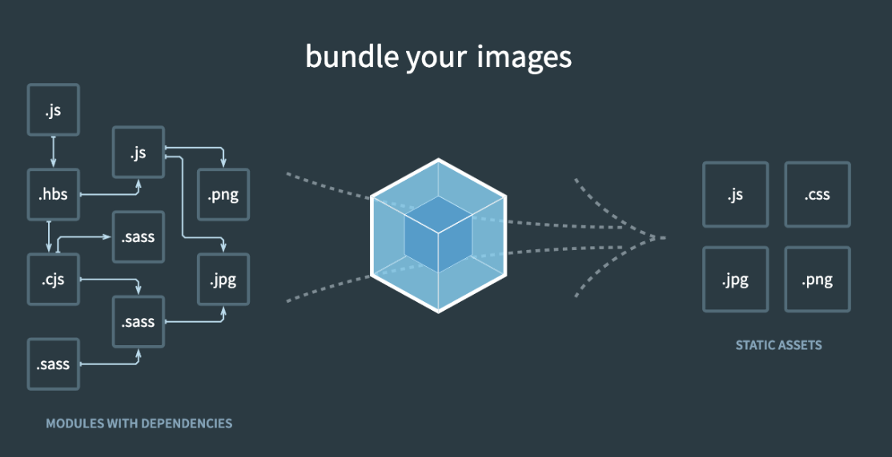

# Webpack

> 출처: [프론트엔드 개발자를 위한 웹팩](https://www.inflearn.com/course/%ED%94%84%EB%9F%B0%ED%8A%B8%EC%97%94%EB%93%9C-%EC%9B%B9%ED%8C%A9/dashboard)

## NPM

NPM(Node Package Manager)는 명령어로 자바스크립트 라이브러리를 설치하고 관리할 수 있는 패키지 매니저

### NPM 사용하는 이유와 장점

#### 첫 번째 장점

- 웹 페이지를 제작 중 필요한 라이브러리가 있어 근처에 \<script>를 넣어서 해당 태그에 라이브러리가 돌아가도록 작성하는 안좋은 경우가 있다.
  - 라이브러리가 태그 어딘가에 들어와도 돌아간다는 것이 웹 페이지의 유연함
  - 다른 사람이 개발한 소스에 어떤 라이브러리를 사용했는지 알기 위해서는 \<script> 태그를 모두 찾아야 하는 번거로움이 있다.
  - 라이브러리를 관리와 의존성 측면에서 매우 떨어진 것을 알 수 있다.
- 이 떄 `package.json`을 이용하여 정리가 잘되어있다면 의존성과 버전 관리가 매우 편리해진다.

#### 두 번째 장점

- 라이브러리 cdn을 검색해서 주소를 가져오면 상당히 번거롭고 HTML 파일이 매우 가독성이 안좋아질 수 있다.
  - 이 때 **npm**을 이용한다면 간단한 명령어만으로 내 로컬 컴퓨터 환경의 프로젝트 폴더 밑 **node_modules** 밑에 필요한 라이브러리를 설치할 수 있으므로 매우 편리하다.

### 명령어

#### `npm init`

- npm 초기화 명령어(시작하기)

  ```
  package name: (이름)
  version: (1.0.0)
  description:
  entry point: (index.js)
  test command:
  git repository:
  keywords:
  author:
  license: (ISC)
  ```

  - 위 순서대로 pacekage.json에 대해 설정하면 해당 프로젝트 폴더 안에 파일이 생성된 것을 확인할 수 있다.
  - 바로 파일 생성 후 수정하고 싶으면 `npm init -y`을 실행

#### `npm install (패키지) --save-prod`

- npm을 이용해서 라이브러리를 설치하는 명령어
  - 해당 명령어를 실행하면 **node_modules** 폴더가 생성된 것을 확인할 수 있다.
  - **node_modules** 폴더 안에 해당 라이브러리가 설치되고,
  - **package.json** 파일 내 **dependencies** 안에 해당 패키지 이름과 버전이 작성된 것을 확인할 수 있다.
- 지역 설치 명령어의 경우 명령어 옵션으로 `--save-prod`를 붙이지 않아도 동일한 효과가 난다.
- `install` 대신 `i`를 사용해도 된다.

#### **NPM 지역 설치 옵션 2가지**

```
npm install jquery --save-prod -> npm i jquery
npm install jquery --save-dev -> npm i jquery -D
```

- 오른쪽처럼 축약 가능하다.
- 여기서 설치 옵션에 아무것도 넣지 않은 `npm i query`는 `package.json`의 `dependencies`에 등록된다.
- 설치 옵션으로 `-D`를 넣은 경우에는 해당 라이브러리가 `package.json`의 `devDependencies`에 등록된다.

#### `npm stall (패키지) --global`

- NPM 전역 설치할 때 사용하는 명령어로, 프로젝트에서 사용할 라이브러리를 불러올 때 사용하는 것이 아니라 시스템 레벨에서 사용할 자바스크립트 라이브러리를 설치할 때 사용한다.
  - 라이브러리가 설치되고 나면 이제 명령어 실행 창에 해당 라이브러리 이름을 입력했을 때 명령어를 인식한다.
- 전역 설치 명령어 옵션 `--global` 대신 `-g`를 사용해도 된다.
- 전역 설치 명령어를 입력했을 때 Permission 에러가 발생하면 `sudo npm install (패키지) --global`
- NPM 전역 설치 경로

  - 이렇게 설치된 자바스크립트 라이브러리는 어느 위치에 해당 명령어를 실행했던 간에 OS별로 아래와 같은 폴더 경로에 설치된다.

  ```sh
  # window
  %USERPROFILE%\AppData\Roaming\npm\node_modules

  # mac
  /usr/local/lib/node_modules
  ```

#### `npm uninstall (패키지)`

- 설치한 라이브러리를 삭제하는 명령어
  - 만약 `dependencies`에 있었다면 목록 내 삭제되면서 **node_modules**에서 관련된 라이브러리까지 삭제된다.

### **개발용 라이브러리와 배포용 라이브러리 구분하기**

- NPM 지역 설치를 할 때는 해당 라이브러리가 배포용(dependencies)인지 개발용(devDependencies)인지 꼭 구분해주어야 한다.
- 예를 들어, `jquery`와 같이 화면과 직접적으로 관련된 라이브러리는 배포용으로 설치해야 한다.
  - 이렇게 설치된 배포용 라이브러리는 `npm run build`로 빌드를 하면 최종 애플리케이션 코드 안에 포함된다.
  - 애플리케이션 로직과 직접적으로 관련되어 있으면 배포용으로 설치!
- 만약 반대로 설치 옵션에 `-D`를 주었다면 **해당 라이브러리는 빌드하고 배포할 때 애플리케이션 코드에서 빠지게 된다.**
  - 따라서, 최종 애플리케이션에 포함되어야 하는 라이브러리는 `-D`로 설치해서는 안된다.
  - 만약, 구분없이 dependencies에만 모두 라이브러리를 설치하게 되면 빌드시간이 상당히 오래걸릴 수 있다.
  - 개발할 때만 사용하고 배포할 때는 빠져도 좋은 라이브러리 예시
    - `webpack`: 빌드 도구
    - `eslint`: 코드 문법 검사 도구
    - `imagein`: 이미지 압축 도구

## Webpack 시작하기

### 웹팩(Webpack)이란?

웹팩이란 최신 프론트엔드 프레임워크에서 가장 많이 사용되는 **모듈 번들러(Module Bundler)**이다.  
모듈 번들러란 웹 애플리케이션을 구성하는 자원(HTML, CSS, JavaScript, Images 등)을 모두 각각의 모듈로 보고 이를 조합해서 병합된 하나의 결과물을 만드는 도구를 의미한다. 여기서 **모듈**과 **모듈 번들링**이란??

### 모듈(Module)이란?

모듈이란 프로그래밍 관점에서 특정 기능을 갖는 작은 코드 단위를 의미한다. 자바스크립트로 치면 아래와 같은 코드가 모듈이다.

```js
// math.js
function sum(a, b) {
  return a + b;
}
function substract(a, b) {
  return a - b;
}

const pi = 3.14;

export { sum, substract, pi };
```

이 `math.js` 파일은 아래와 같이 3가지 기능을 갖고 있는 모듈이다.

1. 두 숫자의 합을 구하는 `sum()` 함수
2. 두 숫자의 차를 구하는 `substract()` 함수
3. 원주율 값을 갖는 `pi` 상수

이처럼 성격이 비슷한 기능들을 하나의 의미 있는 파일로 관리하면 모듈이 된다.

#### **웹팩에서의 모듈**

웹팩에서 지칭하는 `모듈`이라는 개념은 위와 같이 자바스크립트 모듈에만 국한되지 않고 웹 애플리케이션을 구성하는 모든 자원을 의미한다. 웹 애플맄이션을 제작하려면 HTML, CSS, JavaScript, Images, Font 등 많은 파일들이 필요하다. 이 파일 하나하나가 모두 모듈이다!

### 모듈 번들링(Module Bundling)이란?

아래 그림과 같이 웹 애플리케이션을 구성하는 몇십, 몇백개의 자원들을 **하나의 파일로 병합 및 압축 해주는 동작**을 모듈 번들링이라고 한다.

<div style="text-align: center">
  
</div>

- 왼쪽이 하나의 웹 서비스를 구성하는 파일들이고 보면, 모듈 번들러인 웹팩이 파일들 간의 연관관계를 모두 파악및 해석해서 하나의 파일로 변환을 해준다.
  - **즉, 웹팩은 자바스크립트만을 위한 것이 아니라 웹 페이지를 구성하는 모든 자원과 관계된 도구라고 생각하면 좋다.**
  - 필요에 의해서 js 파일 뿐만이 아니라 css 파일로 분할할 수 있고, jpg, png처럼 이미지 압축 및 최적화까지 할 수 있다.
    - lazy loading, code splitting 등..
  - 빌드, 번들링, 변환 이 세 단어 모두 같은 의미로 모두 하나로 합친다는 관점으로 보면 된다.

## 웹팩 소개

### 웹팩의 등장 배경

웹팩이 등장한 이유는 크게 3가지이다.

- **파일 단위의 자바스크립트 모듈 관리의 필요성**
- **웹 개발 작업 자동화 도구 (Web Task Manager)**
- **웹 애플리케이션의 빠른 로딩 속도와 높은 성능**

### 파일 단위의 자바스크립트 모듈 관리

입문자 관점에서 고안된 자바스크립트는 아래와 같인 편리한 유효 범위를 갖고 있다.

```js
var a = 10;
console.log(a); // 10

function logText(a) {
  console.log(a); // 10
}
```

**자바스크립트의 변수 유효 범위는 기본적으로 전역 범위를 갖는다.** 최대한 넓은 변수 범위를 갖기 때문에 어디에서도 접근하기가 편리하다.  
하지만 이러한 장점이 실제로 웹 애플리케이션을 개발할 때는 아래와 같은 문제점으로 변한다.

```html
<!-- index.html -->
<html>
  <head>
    <!-- .. -->
  </head>
  <body>
    <!-- .. -->
    <script src="./app.js"></script>
    <script src="./main.js"></script>
    <script>
      getNum();
    </script>
  </body>
</html>
```

```js
// app.js
var num = 10;
function getNum() {
  console.log(num); // 10
}
```

```js
var num = 10;
function getNum() {
  console.log(num); // 20
}
```

위와 같이 `index.html`에서 두 자바스크립트 파일을 로딩하여 사용한다고 했을때, 스크립트에서 위처럼 코드를 실행하면 어떤 결과가 나올까?  
결과는 **20**이다. `app.js`에서 선언한 `num` 변수는 `main.js`에서 다시 선언하고 20을 다시 할당했기 때문이다.  
이러한 문제점은 실제로 복잡한 애플리케이션을 개발할 때도 발생한다. 변수의 이름을 모두 기억하지 않은 이상 변수를 중복 선언하거나 의도치 않은 값을 할당할 수 있다.  
이처럼 파일 단위로 변수를 관리하고 싶은 욕구, 자바스크립트 모듈화에 대한 욕구를 예전까진 `AMD`, `Common.js`와 같은 라이브러리로 풀어 왔다.

### 웹 개발 작업 자동화 도구

이전에는 코드가 변경되었을 때 변경된 수정사항이 잘 반영되었는지 확인하기 위해서 새로고침을 사용했다. 이를 해결하기 위해 지금은 코드 편집기의 플러그 인을 이용할 수 있지만 제공이 되기 전에는 라이브러리를 사용했다.  
웹 서비스를 개발하고 웹 서버에 배포할 떄 Grunt와 Gulp와 같은 자동화 도구로 아래와 같은 작업들을 진행했다.

- HTML, CSS, JS 압축
- 이미지 압축
- CSS 전처리기 변환
- 최신 문법을 지원하기 않는 브라우저를 위해 JS 문법 변환 등

여기에 추가로 **모듈 관리 기능**까지 제공하는 것이 `Webpack`이다!

### 웹 애플리케이션의 빠른 로딩 속도와 높은 성능

현대 웹 특성 상 빠른 로딩 속도와 높은 UX을 요구하기 때문에 이를 소화하기 위해서 기본적으로 5초 이내에 웹사이트가 표시되어야 한다. 만약 5초 이내의 웹 사이트가 표시되지 않으면 대부분의 사용자들은 해당 사이트를 벗어나거나 집중력을 잃게 된다.  
이전에는 이를 위한 방법 중 하나로 브라우저에 서버로 요청하는 파일 숫자를 줄이기 위해 **웹 태스트 매니저**를 이용해 파일들을 압축하고 병합하는 작업들을 진행했다. 하지만, 쓰지 않는 라이브러리를 뺴는 등의 작업에는 한계가 있다.  
웹팩을 사용하면 초기 페이지 로딩 속도를 높이기 나중에 필요한 자원들은 나중에 요청하는 `레이디 로딩(Lazy Loading)` 기법까지 사용할 수 있게 된다.  
**웹팩은 기본적으로 필요한 자원은 미리 로딩하는게 아니라 그 때 그 때 요청하자는 철학을 갖고 있다!**

### 웹팩으로 해결하려는 문제 4가지

- 웹팩에서 해결하고자 하는 기존의 문제점 4가지
  - **자바스크립트 변수 유효 범위**
  - **브라우저별 HTTP 요청 숫자의 제약**
  - **사용하지 않는 코드의 관리**
  - **Dynamic Loading & Lazy Loading 미지원**

#### 자바스크립트 변수 유효 범위 문제

[파일별로 변수가 구분되지 않는 문제점](#파일-단위의-자바스크립트-모듈-관리)을 웹팩은 변수 유효 범위의 문제점을 **ES6의 Modules** 문법과 웹팩의 모듈 번들링으로 해결한다.

#### 브라우저별 HTTP 요청 숫자의 제약

TCP 스펙에 따라 브라우저에서 한 번에 서버로 보낼 수 있는 HTTP 요청 숫자는 제약되어 있다. 즉, 파일이 100개라면 100개를 한 번에 보내는 것이 아니라 한 번에 보낼 수 있는 최대 연결 횟수로 나눠서 나눠서 보낸다. 네트워크의 요청 횟수 제약을 벗어나는 최적화가 필요했기 때문에 웹팩이 나왔다고 할 수 있다.  
HTTP 요청 숫자를 줄이는 것이 웹 애플리케이션의 성능을 높여줄 뿐만 아니라 사용자가 사이트를 조작하는 시간을 앞당겨 줄 수 있다.

최신 브라우저 별 최대 HTTP 요청 횟수

| 브라우저          | 최대 연결 횟수 |
| ----------------- | -------------- |
| 익스플로러7       | 2              |
| 익스플로러 8 ~ 9  | 6              |
| 익스플로러 10, 11 | 8, 13          |
| 크롬              | 6              |
| 사파리            | 6              |
| 파이어폭스        | 6              |
| 오페라            | 6              |
| 안드로이드, iOS   | 6              |

- 클라이언트에서 서버에 HTTP 요청을 보내기 위해서는 먼저 TCP/IP가 연결되어야 한다.

#### Dynamic Loading & Lazy Loading 미지원

**Require.js**와 같은 라이브러리를 쓰지 않으면 동적으로 원하는 순간에 모듈을 로딩하는 것이 불가능했지만!  
이젠 웹팩의 `Code Splitting` 기능을 이용하여 원하는 모듈을 원하는 타이밍에 로딩할 수 있다. 추가로 쓰지 않는 라이브러리는 사용하지 않는 `Tree Shaking`같은 것으로 떨궈낼 수 있다.

## 웹팩 사용 전과 후 비교하기

### 웹팩 사용 전 파일 구성 및 빌드

<details>
  <summary>웹팩 관련 라이브러리와 lodash 라이브러리 설치</summary>

```bash
npm i webpack webpack-cli -D
npm i lodash
```

</details>

<details>
  <summary>파일 구조</summary>
  ```
  getting-started
    - node_modules
    - src
      - index.js
    - index.html
    - package-lock.json
    - package.json
  ```
</details>

<details>

<summary>index.html</summary>

```html
<!-- index.html -->
<html>
  <head>
    <title>Webpack Demo</title>
    <script src="https://unpkg.com/lodash@4.16.6"></script>
  </head>
  <body>
    <script src="src/index.js"></script>
  </body>
</html>
```

</details>

### 웹팩 빌드를 위한 구성 및 빌드

<details>

<summary>index.js</summary>

```html
<!-- index.html -->
<html>
  <head>
    <title>Webpack Demo</title>
    <!-- <script src="https://unpkg.com/lodash@4.16.6"></script> -->
  </head>
  <body>
    <!-- <script src="src/index.js"></script> -->
    <script src="dist/main.js"></script>
  </body>
</html>
```

</details>

<details>

<summary>index.js</summary>

```js
// index.js
import _ from "lodash";

function component() {
  var element = document.createElement("div");

  /* lodash is required for the next line to work */
  element.innerHTML = _.join(["Hello", "webpack"], " ");

  return element;
}

document.body.appendChild(component());
```

</details>

<details>

<summary>webpack.config.js</summary>

```json
"scripts": {
  "build": "webpack --mode=none"
}
```

- `npm run build` 명령 시 뒤에 설명(옵션)들을 한 줄로 표현하기에는 너무 길고 관리가 어렵기 때문에 아래 `webpack.json.js` 파일을 생성해서 만드는 것이 좋다.

```js
var path = require("path");

module.exports = {
  mode: "none",
  entry: "./src/index.js",
  output: {
    filename: "main.js",
    path: path.resolve(__dirname, "dist"),
  },
};
```

</details>

### 웹팩 적용 전과 후 비교

- 웹팩 적용 전
  - 요청 개수: 5 requests(index.html, lodash@4.16.6, index.js, lodash.js, ws)
  - 요청 완료 시간: 41ms
- 웹팩 적용 후
  - 요청 개수: 3 request(index.html, main.js, ws)
  - 26ms
- 지금 워낙 가볍기 때문에 거의 차이는 없지만 요청 개수가 2개 줄어든 것을 확인할 수 있다.
