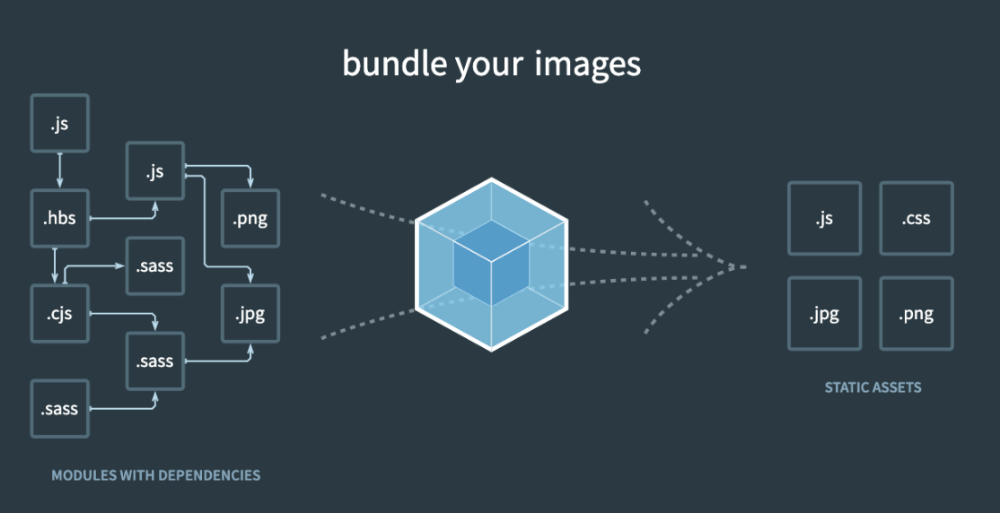
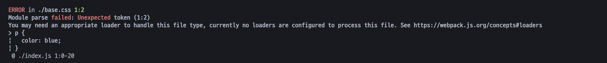

# Webpack

> 출처: [프론트엔드 개발자를 위한 웹팩](https://www.inflearn.com/course/%ED%94%84%EB%9F%B0%ED%8A%B8%EC%97%94%EB%93%9C-%EC%9B%B9%ED%8C%A9/dashboard)

## 목차

- [NPM](#npm)
  - [NPM 사용하는 이유와 장점](#npm-사용하는-이유와-장점)
  - [명령어](#명령어)
  - [개발용 라이브러리와 배포용 라이브러리 구분하기](#개발용-라이브러리와-배포용-라이브러리-구분하기)
- [Webpack 시작하기](#webpack-시작하기)
  - [웹팩(Webpack)이란?](#웹팩webpack이란)
  - [모듈(Module)이란?](#모듈module이란)
  - [모듈 번들링(Module Bundling)이란?](#모듈-번들링module-bundling이란)
- [웹팩 소개](#웹팩-소개)
  - [웹팩의 등장 배경](#웹팩의-등장-배경)
  - [파일 단위의 자바스크립트 모듈 관리](#파일-단위의-자바스크립트-모듈-관리)
  - [웹 개발 작업 자동화 도구](#웹-개발-작업-자동화-도구)
  - [웹 애플리케이션의 빠른 로딩 속도와 높은 성능](#웹-애플리케이션의-빠른-로딩-속도와-높은-성능)
- [웹팩으로 해결하려는 문제 4가지](#웹팩으로-해결하려는-문제-4가지)
  - [자바스크립트 변수 유효 범위 문제](#자바스크립트-변수-유효-범위-문제)
  - [브라우저별 HTTP 요청 숫자의 제약](#브라우저별-http-요청-숫자의-제약)
  - [Dynamic Loading & 미지원](#dynamic-loading--lazy-loading-미지원)
  - [웹팩 적용 전과 후 비교](#웹팩-적용-전과-후-비교)
- [웹팩의 4가지 주요 속성](#웹팩의-4가지-주요-속성)
  - [Entry](#entry)
  - [Output](#output)
  - [Loader](#loader)
  - [Plugin](#plugin)
  - [주요 속성 4가지 정리](#주요-속성-4가지-정리)
- [Developer Tools](#developer-tools)
  - [Webpack Dev Server](#webpack-dev-server)
  - [Hot Module Replacement](#hot-module-replacement)
  - [Source Map](#source-map)

## NPM

NPM(Node Package Manager)는 명령어로 자바스크립트 라이브러리를 설치하고 관리할 수 있는 패키지 매니저

### NPM 사용하는 이유와 장점

#### 첫 번째 장점

- 웹 페이지를 제작 중 필요한 라이브러리가 있어 근처에 \<script>를 넣어서 해당 태그에 라이브러리가 돌아가도록 작성하는 안좋은 경우가 있다.
  - 라이브러리가 태그 어딘가에 들어와도 돌아간다는 것이 웹 페이지의 유연함
  - 다른 사람이 개발한 소스에 어떤 라이브러리를 사용했는지 알기 위해서는 \<script> 태그를 모두 찾아야 하는 번거로움이 있다.
  - 라이브러리를 관리와 의존성 측면에서 매우 떨어진 것을 알 수 있다.
- 이 떄 `package.json`을 이용하여 정리가 잘되어있다면 의존성과 버전 관리가 매우 편리해진다.

#### 두 번째 장점

- 라이브러리 cdn을 검색해서 주소를 가져오면 상당히 번거롭고 HTML 파일이 매우 가독성이 안좋아질 수 있다.
  - 이 때 **npm**을 이용한다면 간단한 명령어만으로 내 로컬 컴퓨터 환경의 프로젝트 폴더 밑 **node_modules** 밑에 필요한 라이브러리를 설치할 수 있으므로 매우 편리하다.

### 명령어

#### `npm init`

- npm 초기화 명령어(시작하기)

  ```
  package name: (이름)
  version: (1.0.0)
  description:
  entry point: (index.js)
  test command:
  git repository:
  keywords:
  author:
  license: (ISC)
  ```

  - 위 순서대로 pacekage.json에 대해 설정하면 해당 프로젝트 폴더 안에 파일이 생성된 것을 확인할 수 있다.
  - 바로 파일 생성 후 수정하고 싶으면 `npm init -y`을 실행

#### `npm install (패키지) --save-prod`

- npm을 이용해서 라이브러리를 설치하는 명령어
  - 해당 명령어를 실행하면 **node_modules** 폴더가 생성된 것을 확인할 수 있다.
  - **node_modules** 폴더 안에 해당 라이브러리가 설치되고,
  - **package.json** 파일 내 **dependencies** 안에 해당 패키지 이름과 버전이 작성된 것을 확인할 수 있다.
- 지역 설치 명령어의 경우 명령어 옵션으로 `--save-prod`를 붙이지 않아도 동일한 효과가 난다.
- `install` 대신 `i`를 사용해도 된다.

#### **NPM 지역 설치 옵션 2가지**

```
npm install jquery --save-prod -> npm i jquery
npm install jquery --save-dev -> npm i jquery -D
```

- 오른쪽처럼 축약 가능하다.
- 여기서 설치 옵션에 아무것도 넣지 않은 `npm i query`는 `package.json`의 `dependencies`에 등록된다.
- 설치 옵션으로 `-D`를 넣은 경우에는 해당 라이브러리가 `package.json`의 `devDependencies`에 등록된다.

#### `npm stall (패키지) --global`

- NPM 전역 설치할 때 사용하는 명령어로, 프로젝트에서 사용할 라이브러리를 불러올 때 사용하는 것이 아니라 시스템 레벨에서 사용할 자바스크립트 라이브러리를 설치할 때 사용한다.
  - 라이브러리가 설치되고 나면 이제 명령어 실행 창에 해당 라이브러리 이름을 입력했을 때 명령어를 인식한다.
- 전역 설치 명령어 옵션 `--global` 대신 `-g`를 사용해도 된다.
- 전역 설치 명령어를 입력했을 때 Permission 에러가 발생하면 `sudo npm install (패키지) --global`
- NPM 전역 설치 경로

  - 이렇게 설치된 자바스크립트 라이브러리는 어느 위치에 해당 명령어를 실행했던 간에 OS별로 아래와 같은 폴더 경로에 설치된다.

  ```sh
  # window
  %USERPROFILE%\AppData\Roaming\npm\node_modules

  # mac
  /usr/local/lib/node_modules
  ```

#### `npm uninstall (패키지)`

- 설치한 라이브러리를 삭제하는 명령어
  - 만약 `dependencies`에 있었다면 목록 내 삭제되면서 **node_modules**에서 관련된 라이브러리까지 삭제된다.

### 개발용 라이브러리와 배포용 라이브러리 구분하기

- NPM 지역 설치를 할 때는 해당 라이브러리가 배포용(dependencies)인지 개발용(devDependencies)인지 꼭 구분해주어야 한다.
- 예를 들어, `jquery`와 같이 화면과 직접적으로 관련된 라이브러리는 배포용으로 설치해야 한다.
  - 이렇게 설치된 배포용 라이브러리는 `npm run build`로 빌드를 하면 최종 애플리케이션 코드 안에 포함된다.
  - 애플리케이션 로직과 직접적으로 관련되어 있으면 배포용으로 설치!
- 만약 반대로 설치 옵션에 `-D`를 주었다면 **해당 라이브러리는 빌드하고 배포할 때 애플리케이션 코드에서 빠지게 된다.**
  - 따라서, 최종 애플리케이션에 포함되어야 하는 라이브러리는 `-D`로 설치해서는 안된다.
  - 만약, 구분없이 dependencies에만 모두 라이브러리를 설치하게 되면 빌드시간이 상당히 오래걸릴 수 있다.
  - 개발할 때만 사용하고 배포할 때는 빠져도 좋은 라이브러리 예시
    - `webpack`: 빌드 도구
    - `eslint`: 코드 문법 검사 도구
    - `imagein`: 이미지 압축 도구

## Webpack 시작하기

### 웹팩(Webpack)이란?

웹팩이란 최신 프론트엔드 프레임워크에서 가장 많이 사용되는 **모듈 번들러(Module Bundler)**이다.  
모듈 번들러란 웹 애플리케이션을 구성하는 자원(HTML, CSS, JavaScript, Images 등)을 모두 각각의 모듈로 보고 이를 조합해서 병합된 하나의 결과물을 만드는 도구를 의미한다. 여기서 **모듈**과 **모듈 번들링**이란??

### 모듈(Module)이란?

모듈이란 프로그래밍 관점에서 특정 기능을 갖는 작은 코드 단위를 의미한다. 자바스크립트로 치면 아래와 같은 코드가 모듈이다.

```js
// math.js
function sum(a, b) {
  return a + b;
}
function substract(a, b) {
  return a - b;
}

const pi = 3.14;

export { sum, substract, pi };
```

이 `math.js` 파일은 아래와 같이 3가지 기능을 갖고 있는 모듈이다.

1. 두 숫자의 합을 구하는 `sum()` 함수
2. 두 숫자의 차를 구하는 `substract()` 함수
3. 원주율 값을 갖는 `pi` 상수

이처럼 성격이 비슷한 기능들을 하나의 의미 있는 파일로 관리하면 모듈이 된다.

#### **웹팩에서의 모듈**

웹팩에서 지칭하는 `모듈`이라는 개념은 위와 같이 자바스크립트 모듈에만 국한되지 않고 웹 애플리케이션을 구성하는 모든 자원을 의미한다. 웹 애플맄이션을 제작하려면 HTML, CSS, JavaScript, Images, Font 등 많은 파일들이 필요하다. 이 파일 하나하나가 모두 모듈이다!

### 모듈 번들링(Module Bundling)이란?

아래 그림과 같이 웹 애플리케이션을 구성하는 몇십, 몇백개의 자원들을 **하나의 파일로 병합 및 압축 해주는 동작**을 모듈 번들링이라고 한다.

<div style="text-align: center">
  
</div>

- 왼쪽이 하나의 웹 서비스를 구성하는 파일들이고 보면, 모듈 번들러인 웹팩이 파일들 간의 연관관계를 모두 파악및 해석해서 하나의 파일로 변환을 해준다.
  - **즉, 웹팩은 자바스크립트만을 위한 것이 아니라 웹 페이지를 구성하는 모든 자원과 관계된 도구라고 생각하면 좋다.**
  - 필요에 의해서 js 파일 뿐만이 아니라 css 파일로 분할할 수 있고, jpg, png처럼 이미지 압축 및 최적화까지 할 수 있다.
    - lazy loading, code splitting 등..
  - 빌드, 번들링, 변환 이 세 단어 모두 같은 의미로 모두 하나로 합친다는 관점으로 보면 된다.

## 웹팩 소개

### 웹팩의 등장 배경

웹팩이 등장한 이유는 크게 3가지이다.

- **파일 단위의 자바스크립트 모듈 관리의 필요성**
- **웹 개발 작업 자동화 도구 (Web Task Manager)**
- **웹 애플리케이션의 빠른 로딩 속도와 높은 성능**

### 파일 단위의 자바스크립트 모듈 관리

입문자 관점에서 고안된 자바스크립트는 아래와 같인 편리한 유효 범위를 갖고 있다.

```js
var a = 10;
console.log(a); // 10

function logText(a) {
  console.log(a); // 10
}
```

**자바스크립트의 변수 유효 범위는 기본적으로 전역 범위를 갖는다.** 최대한 넓은 변수 범위를 갖기 때문에 어디에서도 접근하기가 편리하다.  
하지만 이러한 장점이 실제로 웹 애플리케이션을 개발할 때는 아래와 같은 문제점으로 변한다.

```html
<!-- index.html -->
<html>
  <head>
    <!-- .. -->
  </head>
  <body>
    <!-- .. -->
    <script src="./app.js"></script>
    <script src="./main.js"></script>
    <script>
      getNum();
    </script>
  </body>
</html>
```

```js
// app.js
var num = 10;
function getNum() {
  console.log(num); // 10
}
```

```js
var num = 10;
function getNum() {
  console.log(num); // 20
}
```

위와 같이 `index.html`에서 두 자바스크립트 파일을 로딩하여 사용한다고 했을때, 스크립트에서 위처럼 코드를 실행하면 어떤 결과가 나올까?  
결과는 **20**이다. `app.js`에서 선언한 `num` 변수는 `main.js`에서 다시 선언하고 20을 다시 할당했기 때문이다.  
이러한 문제점은 실제로 복잡한 애플리케이션을 개발할 때도 발생한다. 변수의 이름을 모두 기억하지 않은 이상 변수를 중복 선언하거나 의도치 않은 값을 할당할 수 있다.  
이처럼 파일 단위로 변수를 관리하고 싶은 욕구, 자바스크립트 모듈화에 대한 욕구를 예전까진 `AMD`, `Common.js`와 같은 라이브러리로 풀어 왔다.

### 웹 개발 작업 자동화 도구

이전에는 코드가 변경되었을 때 변경된 수정사항이 잘 반영되었는지 확인하기 위해서 새로고침을 사용했다. 이를 해결하기 위해 지금은 코드 편집기의 플러그 인을 이용할 수 있지만 제공이 되기 전에는 라이브러리를 사용했다.  
웹 서비스를 개발하고 웹 서버에 배포할 떄 Grunt와 Gulp와 같은 자동화 도구로 아래와 같은 작업들을 진행했다.

- HTML, CSS, JS 압축
- 이미지 압축
- CSS 전처리기 변환
- 최신 문법을 지원하기 않는 브라우저를 위해 JS 문법 변환 등

여기에 추가로 **모듈 관리 기능**까지 제공하는 것이 `Webpack`이다!

### 웹 애플리케이션의 빠른 로딩 속도와 높은 성능

현대 웹 특성 상 빠른 로딩 속도와 높은 UX을 요구하기 때문에 이를 소화하기 위해서 기본적으로 5초 이내에 웹사이트가 표시되어야 한다. 만약 5초 이내의 웹 사이트가 표시되지 않으면 대부분의 사용자들은 해당 사이트를 벗어나거나 집중력을 잃게 된다.  
이전에는 이를 위한 방법 중 하나로 브라우저에 서버로 요청하는 파일 숫자를 줄이기 위해 **웹 태스트 매니저**를 이용해 파일들을 압축하고 병합하는 작업들을 진행했다. 하지만, 쓰지 않는 라이브러리를 뺴는 등의 작업에는 한계가 있다.  
웹팩을 사용하면 초기 페이지 로딩 속도를 높이기 나중에 필요한 자원들은 나중에 요청하는 `레이디 로딩(Lazy Loading)` 기법까지 사용할 수 있게 된다.  
**웹팩은 기본적으로 필요한 자원은 미리 로딩하는게 아니라 그 때 그 때 요청하자는 철학을 갖고 있다!**

## 웹팩으로 해결하려는 문제 4가지

- 웹팩에서 해결하고자 하는 기존의 문제점 4가지
  - **자바스크립트 변수 유효 범위**
  - **브라우저별 HTTP 요청 숫자의 제약**
  - **사용하지 않는 코드의 관리**
  - **Dynamic Loading & Lazy Loading 미지원**

### 자바스크립트 변수 유효 범위 문제

[파일별로 변수가 구분되지 않는 문제점](#파일-단위의-자바스크립트-모듈-관리)을 웹팩은 변수 유효 범위의 문제점을 **ES6의 Modules** 문법과 웹팩의 모듈 번들링으로 해결한다.

### 브라우저별 HTTP 요청 숫자의 제약

TCP 스펙에 따라 브라우저에서 한 번에 서버로 보낼 수 있는 HTTP 요청 숫자는 제약되어 있다. 즉, 파일이 100개라면 100개를 한 번에 보내는 것이 아니라 한 번에 보낼 수 있는 최대 연결 횟수로 나눠서 나눠서 보낸다. 네트워크의 요청 횟수 제약을 벗어나는 최적화가 필요했기 때문에 웹팩이 나왔다고 할 수 있다.  
HTTP 요청 숫자를 줄이는 것이 웹 애플리케이션의 성능을 높여줄 뿐만 아니라 사용자가 사이트를 조작하는 시간을 앞당겨 줄 수 있다.

최신 브라우저 별 최대 HTTP 요청 횟수

| 브라우저          | 최대 연결 횟수 |
| ----------------- | -------------- |
| 익스플로러7       | 2              |
| 익스플로러 8 ~ 9  | 6              |
| 익스플로러 10, 11 | 8, 13          |
| 크롬              | 6              |
| 사파리            | 6              |
| 파이어폭스        | 6              |
| 오페라            | 6              |
| 안드로이드, iOS   | 6              |

- 클라이언트에서 서버에 HTTP 요청을 보내기 위해서는 먼저 TCP/IP가 연결되어야 한다.

### Dynamic Loading & Lazy Loading 미지원

**Require.js**와 같은 라이브러리를 쓰지 않으면 동적으로 원하는 순간에 모듈을 로딩하는 것이 불가능했지만!  
이젠 웹팩의 `Code Splitting` 기능을 이용하여 원하는 모듈을 원하는 타이밍에 로딩할 수 있다. 추가로 쓰지 않는 라이브러리는 사용하지 않는 `Tree Shaking`같은 것으로 떨궈낼 수 있다.

## 웹팩 사용 전과 후 비교하기

### 웹팩 사용 전 파일 구성 및 빌드

<details>
  <summary>웹팩 관련 라이브러리와 lodash 라이브러리 설치</summary>

```bash
npm i webpack webpack-cli -D
npm i lodash
```

</details>

<details>
  <summary>파일 구조</summary>
  ```
  getting-started
    - node_modules
    - src
      - index.js
    - index.html
    - package-lock.json
    - package.json
  ```
</details>

<details>

<summary>index.html</summary>

```html
<!-- index.html -->
<html>
  <head>
    <title>Webpack Demo</title>
    <script src="https://unpkg.com/lodash@4.16.6"></script>
  </head>
  <body>
    <script src="src/index.js"></script>
  </body>
</html>
```

</details>

### 웹팩 빌드를 위한 구성 및 빌드

<details>

<summary>index.js</summary>

```html
<!-- index.html -->
<html>
  <head>
    <title>Webpack Demo</title>
    <!-- <script src="https://unpkg.com/lodash@4.16.6"></script> -->
  </head>
  <body>
    <!-- <script src="src/index.js"></script> -->
    <script src="dist/main.js"></script>
  </body>
</html>
```

</details>

<details>

<summary>index.js</summary>

```js
// index.js
import _ from "lodash";

function component() {
  var element = document.createElement("div");

  /* lodash is required for the next line to work */
  element.innerHTML = _.join(["Hello", "webpack"], " ");

  return element;
}

document.body.appendChild(component());
```

</details>

<details>

<summary>webpack.config.js</summary>

```json
"scripts": {
  "build": "webpack --mode=none"
}
```

- `npm run build` 명령 시 뒤에 설명(옵션)들을 한 줄로 표현하기에는 너무 길고 관리가 어렵기 때문에 아래 `webpack.json.js` 파일을 생성해서 만드는 것이 좋다.

```js
var path = require("path");

module.exports = {
  mode: "none",
  entry: "./src/index.js",
  output: {
    filename: "main.js",
    path: path.resolve(__dirname, "dist"),
  },
};
```

</details>

### 웹팩 적용 전과 후 비교

- 웹팩 적용 전
  - 요청 개수: 5 requests(index.html, lodash@4.16.6, index.js, lodash.js, ws)
  - 요청 완료 시간: 41ms
- 웹팩 적용 후
  - 요청 개수: 3 request(index.html, main.js, ws)
  - 26ms
- 지금 속도는 워낙 가볍기 때문에 거의 차이는 없지만 요청 개수는 2개 줄어든 것을 확인할 수 있다.

## 웹팩의 4가지 주요 속성

### Entry

`entry` 속성은 웹팩에서 웹 자원을 변환하기 위해 필요한 최초 진입점이자 자바스크립트 파일 경로이다. 즉, 빌드 대상이다.

```js
//webpack.config.js
module.exports = {
  entry: "./src/index.js",
};
```

- 위 코드는 웹팩을 실행했을 때 `src` 폴더 밑의 `index.js`을 대상으로 웹팩이 빌드를 수행하는 코드이다.

#### Entry 파일에는 어떤 내용이 들어가야 하나?

`entry` 속성으로 지정된 파일에는 **웹 애플리케이션의 전반적인 구조와 내용**이 담겨져 있어야 한다. 웹팩이 해당 파일을 가지고 웹 애플리케이션에서 사용되는 모듈들의 연관관계를 이해하고 분석하기 때문에 애플리케이션을 동작시킬 수 있는 내용들이 담겨져 있어야 한다.  
예를 들어, 블로그 서비스를 웹팩으로 빌드한하고 했을 때 코드의 모양이 아래와 같을 수 있다.

```js
// index.js
import Login from "./LoginView.js";
import HomeView from "./HomeView.js";
import PostView from "./PostView.js";

function initApp() {
  LoginView.init();
  HomeView.init();
  PostView.init();
}

initApp();
```

위 코드는 해당 서비스가 `SPA`이라고 가정했을 떄의 코드인데 사용자의 **로그인 화면**, 로그인 후 진입하는 **메인 화면**, 그리고 **게시글을 작성하는 화면** 등 웹 서비스에 필요한 화면들이 모두 `index.js` 파일에서 불러져 사용되고 있기 때문에 웹팩을 실행하면 파일들의 내용까지 해석하여 파일을 빌드해준다.

```
모듈 간의 의존 관계가 생기는 구조 -> 디펜던시 그래프(Dependency Graph)

    빌드              LoginView.js
                  /
웹팩 ---> index.js -- HomeView.js
                  \
                     PostView.js
```

#### Entry 유형

```js
entry: {
  login: "./src/LoginView.js",
  main: "./src/MainView.js",
}
```

- 위와 같이 엔트리 포인트를 분리하는 경우는 싱글 페이지 애플리케이션이 아닌 특정 페이지로 진입했을 때 서버에서 해당 정보를 내려주는 형태의 `MPA`에 적합하다.

### Output

`output` 속성은 웹팩을 돌리고 난 결과물의 파일 경로를 의미한다. `entry` 속성과는 다르게 객체 형태로 옵션들을 추가해야 한다.

```js
// webpack.config.js
var path = require("path");

module.exports = {
  output: {
    filename: "bundle.js",
    path: path.resolve(__dirname, "./dist"),
  },
};
```

- **filename**: 웹팩으로 빌드한 파일의 이름
- **path**: 해당 파일의 경로
  - `path.resolve()`는 인자로 넘어온 경로들을 조합하여 유효한 파일 경로르 만들어주는 Node.js API

#### Output 파일 이름 옵션

- 아래와 같이 생성된 결과 파일의 이름에는 각각 엔트리의 이름, 모듈 아이디, 해시 값 등이 포함된다.
  - 내부의 파일 내용과 관계없이 브라우저 캐싱때문에 같은 이름의 파일을 뿌려줄 경우 강제 새로고침해야 하는 경우를 방지할 수 있다.
  - 해시 값 같은 것으로 구분자를 줘서 변화를 인식시킬 수 있다.
- 결과 파일 이름에 `entry` 속성을 포함하는 옵션
  ```js
  module.exports = {
    output: {
      filename: "[name].bundle.js",
    },
  };
  ```
- 결과 파일 이름에 웹팩 내부적으로 사용하는 모듈 ID를 포함하는 옵션
  ```js
  module.exports = {
    output: {
      filename: "[id].bundle.js",
    },
  };
  ```
- 매 빌드시마다 고유 해시값을 붙이는 옵션
  ```js
  module.exports = {
    output: {
      filename: "[name].[hash].bundle.js",
    },
  };
  ```
- 웹팩의 각 모듈 내용을 기준으로 생성된 해시 값을 붙이는 옵션
  ```js
  module.exports = {
    output: {
      filename: "[chunkhash].bundle.js",
    },
  };
  ```

### Loader

`로더(Loader)`는 웹팩이 웹 애플리케이션을 해석할 때(웹팩이 빌드할 때 모듈, 파일들 간의 관계를 해석할 때) 자바스크립트 파일이 아닌 웹 자원(HTML, CSS, Images, 폰트 등)들을 변환할 수 있도록 도와주는 속성으로 `module`이라는 이름을 사용한다.

```js
// webpack.config.js
module.exports = {
  module: {
    rules: [],
  },
};
```

#### Loader가 필요한 이유

웹팩으로 애플리케이션을 빌드할 때 아래와 같은 코드를 빌드하기되면 에러가 발생한다.

```js
// app.js
import "./common.css";

console.log("css loaded");
```

```css
// base.css
p {
  color: blue;
}
```

```js
module.exports = {
  entry: "./app.js",
  output: {
    filename: "bundle.js",
  },
};
```



- 위 에러 메시지는 `app.js` 파일에서 임포트한 `base.css` 파일을 해석하기 위해 적절한 로더를 추가해달라는 것이다.

#### CSS Loader 적용

```bash
npm i css-loader -D
```

```js
module.exports = {
  entry: "./app.js",
  output: {
    filename: "bundle.js",
  },
  module: {
    rules: [
      {
        test: /\.css$/,
        use: ["css-loader"],
      },
    ],
  },
};
```

- `module`에서 `rules` 배열에 객체 한 쌍을 추가
  - `test`: 로더를 적용할 파일의 유형(일반적으로 정규 표현식 사용)
  - `use`: 해당 파일에 적용할 로더의 이름
- 즉, 해당 프로젝트의 모든 CSS 파일에 CSS 로더를 적용하겠다는 의미이다.
- **로더를 사용하면 이렇게 JS가 아닌 파일에 대해서도 웹팩이 변환할 수 있게 적용 가능하게 만들어주는 속성이다.**
  - 하지만 `css-loader`만 사용하게 된다면 읽을 수만 있기 때문에 스타일이 적용안된 것을 확인할 수 있다.
  - 추가적으로 로더를 설정해줘야 한다.

#### 자주 사용되는 로더 종류

- [Babel Loader](https://webpack.js.org/loaders/babel-loader/#root)
  ```js
  module.exports = {
    module: {
      rules: [
        // 최신 문법을 지원하지 않는 브라우저를 babel-loader로 변환해주는데 node_modules는 제외
        // node_modules는 라이브러리와 관계된 파일들이 들어있기 때문에 조심!
        {
          test: /\.js$/,
          loader: "babel-loader",
          exclude: /node_modules/,
        },
      ],
    },
  };
  ```
- [Sass Loader](https://webpack.js.org/loaders/sass-loader/#root)
- [File Loader](https://v4.webpack.js.org/loaders/file-loader/)
  ```js
  module.exports = {
    module: {
      rules: [
        // 이미지 속성에 대해 file-loader를 사용해 웹팩이 인식할 수 있게 설정
        {
          test: /\.(png|jpg|gif|svg)$/,
          loader: "file-loader",
          options: {
            name: "[name].[ext]?[hash]",
          },
        },
      ],
    },
  };
  ```
- [Vue Loader](https://github.com/vuejs/vue-loader)
- [TS Loader](https://webpack.js.org/guides/typescript/#loader)
- 로더를 여러 개 사용하는 경우에는 아래와 같이 `rules` 배열에 로더 옵션을 추가하면 된다.
  ```js
  module.exports = {
    module: {
      rules: [
        { test: /\.css$/, use: "css-loader" },
        { test: /\.ts$/, use: "ts-loader" }.
        // ...
      ]
    }
  }
  ```

#### 로더 적용 순서

특정 파일에 대해 여러 개의 로더를 사용하는 경우 로더가 적용되는 순서에 주의해야 합니다. 로더는 기본적으로 **오른쪽에서 왼쪽 순으로 적용**된다.

```js
module: {
    rules: [
      {
        test: /\.css$/,
        use: ["style-loader", "css-loader"], // 둘의 순서를 바꾸면 오류가 발생한다.
      },
    ],
  },
```

- `css-loader`는 css 파일을 웹팩 안에 들어가 해석할 수 있게 해주고, `style-loader`는 웹팩 안에 들어간 css의 style 코드를 /<head> 안에 인라인 스타일로 넣어주는 역할을 한다.
- CSS의 확장 문법인 SCSS 파일에 로더를 적용하기 위해서는 다음과 같아야 한다.
  ```js
  { test: /\.scss$/, use: ["style-loader", "css-loader", "sass-loader"]}
  ```
- 그리고 위와 같이 배열로 입력하는 대신에 아래와 같이 옵션을 포함하는 형태로도 입력할 수 있다.
  ```js
  module: {
    rules: [
      {
        test: /\.css$/,
        use: [
          { loader: "style-loader" },
          {
            loader: "css-loader",
            options: { modules: true },
          },
          { loader: "sass-loader" },
        ],
      },
    ];
  }
  ```

### Plugin

`플러그인(plugin)`은 웹팩의 기본적인 동작에 추가적인 기능을 제공하는 속성이다. 로더랑 비교하면 로더는 파일을 해석하고 변호나하는 과정에 관여하는 반면, 플러그인은 해당 결과몰의 형태를 바꾸는 역할을 한다고 보면 된다.

```js
// webpack.config.js
module.exports = {
  plugins: [],
};
```

위 `Loader`에서 다음과 같이 수정하면 `dist` 폴더 안에 main.css 결과물이 하나 더 생성된 것을 확인할 수 있다.

```js
var path = require("path");
var MiniCssExtractPlugin = require("mini-css-extract-plugin");

module.exports = {
  mode: "none",
  entry: "./index.js",
  output: {
    filename: "bundle.js",
    path: path.resolve(__dirname, "dist"),
  },
  module: {
    rules: [
      {
        test: /\.css$/,
        use: [{ loader: MiniCssExtractPlugin.loader }, "css-loader"],
      },
    ],
  },
  // main.css가 추가적으로 생성되도록 결과물의 형태를 바꾸도록 속성을 추가했다.
  plugins: [new MiniCssExtractPlugin()],
};
```

#### plugin 주의사항

플러그인의 배열에는 생성자 함수로 생성한 객체 인스턴스만 추가될 수 있다.

```js
// webpack.config.js
var webpack = require("webpack");
var HtmlWebpackPlugin = require("html-webpack-plugin");

module.exports = {
  plugins: [new HtmlWebpackPlugin(), new webpack.ProgressPlugin()],
};
```

- `HtmlWebpackPlugin`: 웹팩으로 빌드한 결과물로 HTML 파일을 생성해주는 플러그인
- `ProgressPlugin`: 웹팩의 빌드 진행율을 표시해주는 플러그인

#### 그 외 자주 사용하는 플러그인

- [split-chunks-plugin](https://webpack.js.org/plugins/split-chunks-plugin/)
- [clean-webpack-plugin](https://www.npmjs.com/package/clean-webpack-plugin)
- [image-webpack-loader](https://github.com/tcoopman/image-webpack-loader)
- [webpack-bundle-analyzer-plugin](https://github.com/webpack-contrib/webpack-bundle-analyzer)

### 주요 속성 4가지 정리

```
               변환(= 번들링, 빌드)
Entry --------------------------------> Output  -
     Loader(css, img, ...)                     ↖️ | plugin(결과물 형태 바꾸기)
```

1. `Entry` 속성은 웹팩을 실행할 대상 파일. 진입점
2. `Output` 속성은 웹팩의 결과물에 대한 정보를 입력하는 속성. 일반적으로 `filename`과 `path`를 정의
3. `Loader` 속성은 CSS, 이미지와 같은 비 자바스크립트 파일을 웹팩이 인식할 수 있게 추가하는 속성.
   - 로더는 오른쪽에서 왼쪽으로 적용
4. `Plugin` 속성은 웹팩으로 변환한 파일에 추가적인 기능을 더하고 싶을 때 사용하는 속성
   - 웹팩 변환 과정 전반에 대한 제어권을 갖고 있음
5. 위 속성 이외에도 [Resolve](https://webpack.kr/configuration/resolve/#root), [devServer](https://webpack.kr/configuration/dev-server/#root), [devtool](https://webpack.kr/configuration/devtool/#root) 속성에 대해서도 알고 있으면 좋다
   - 웹팩으로 파일을 해석해나갈 때 즉, 파일들 간의 연관관계를 해석해나갈 때 파일의 해석 방식을 정의할 수 있다.
     ```js
     module.exports = {
       resolve: {
         alias: {
           // vue$에 대해 vue/dist/vue.esm.js 파일을 연결시키겠다는 의미
           vue$: "vue/dist/vue.esm.js",
         },
         // import {} from "./math.js"와 같이 모듈 불러올 때 해당 확장자면 뺴도 된다.
         extensions: ["*", ".js", ".vue", ".json"],
       },
     };
     ```

## Developer Tools

### Webpack Dev Server

- 파일을 업데이트할 때마다 다시 `npm run build`를 해야하는 번거로운 작업이 필요하다. 해당 plugin을 통해 웹팩의 빌드 대상 파일이 변경되었을 때 매번 웹팩 명령어를 실행하지 않아도 코드만 변경하고 저장하면 웹팩으로 빌드한 후 브라우저를 새로고침하도록 설정할 수 있다. 그리고 **웹팩 빌드 시간 또한 줄여주기 때문에 웹팩 기반의 웹 애플리케이션 개발에 필수로 사용된다.**

#### 웹팩 데브 서버의 특징

```json
"scripts": {
  "dev": "webpack serve",
  "build": "webpack"
}
```

- 웹팩 데브 서버로 빌드한 결과물은 메모리에 저장되고 파일로 생성하지는 않기 때문에 컴퓨터 내부적으로는 접근할 수 있지만 사람이 직접 눈으로 보고 파일을 조작할 수는 없다.
  - 빌드한 결과물이 파일 탐색기나 프로젝트 폴더에서 보이지 않는 이유!
- **컴퓨터 구조 관점에서 파일 입출력보다 메모리 입출력이 더 빠르고 컴퓨터 자원이 덜 소모되는 점을 이용한 것이다.**
  - 즉, 파일 레벨로 웬팩 빌드 결과물이 내는 것이 아니라 인메모리 레벨로만 결과물로 내기 때문에 빠르다.
- 따라서, 웹팩 데브 서버는 개발할 때만 사용하다가 개발이 완료되면 웹팩 명령어를 이용해 결과물을 파일로 생성해야 한다.

#### 웹팩 데브 서버 실습

<details>
  <summary>라이브러리 설치</summary>

```bash
npm i webpack webpack-cli webpack-dev-server html-webpack-plugin -D
```

- `package.json` 파일 아래 `scripts` 속성에 위와 같은 커스텀 명령어 추가한다.

</details>

<details>
  <summary>index.html</summary>

```html
<!DOCTYPE html>
<html>
  <head>
    <meta charset="utf-8" />
    <title>Webpack Dev Server</title>
  </head>
  <body>
    <!-- 빌드 결과물이 정상적으로 로딩되면 아래 div 태그의 텍스트가 변경됨 -->
    <div class="container">TBD..</div>
    <!-- HTML Webpack Plugin에 의해 웹팩 빌드 내용이 아래에 추가됨 -->
  </body>
</html>
```

</details>

<details>
  <summary>index.js</summary>

```js
var div = document.querySelector(".container");
div.innerText = "Webpack loaded!!";
```

</details>

<details>
  <summary>웹팩 설정</summary>

```js
var path = require("path");
var HtmlWebpackPlugin = require("html-webpack-plugin");

module.exports = {
  mode: "none",
  entry: "./index.js",
  output: {
    filename: "bundle.js",
    path: path.resolve(__dirname, "dist"),
  },
  devServer: {
    port: 9000,
  },
  plugins: [
    new HtmlWebpackPlugin({
      // index.html 템플릿을 기반으로 빌드 결과물을 추가해줌
      template: "index.html",
    }),
  ],
};
```

</details>

- `npm run dev` 명령어를 입력하여 웹팩 데브 서버 실행한다.
- `localhost:9000`에 접속 후 **Webpack loaded!!**가 뜨는 것을 확인할 수 있다.

#### HtmlWebpackPlugin 설명

- 웹팩으로 빌드한 결과물로 HTML 파일을 생성해주는 플러그인

위 결과물에서 HTML 파일이 index.js가 적용될 수 있는 이유는  
`<script type="text/javascript" src="bundle.js"></script>`는 웹팩에 의해서 빌드 내용이 아래에 추가됐기 때문이다.  
`HtmlWebpackPlugin`의 목적은 웹팩 빌드 결과물에 대해서 HTML 파일을 만들어 주고, 그 안에 빌드 내용까지 포함해서 최종적으로 생성된 HTML 파일을 돌리기만 하면 웹팩의 결과가 들어있는 것이다.

### Hot Module Replacement

HMR은 브라우저를 새로 고치지 않아도 웹팩으로 빌드한 결과물이 웹 애플리케이션에 실시간으로 반영될 수 있게 도와주며, `LiveLoad` 대신에 사용할 수 있으며 웹팩 데브 서버와 함께 사용할 수 있다.  
리액트, 앵귤러, 뷰와 같이 대부분의 프레임워크에서 이미 HMR을 사용할 수 있는 로더들을 지원하고 있지만 만약 개별적으로 설정하고 싶다면 아래와 같은 방식으로 설정 가능하다.

```js
module.exports = {
  devServer: {
    hot: true,
  },
};
```

- 데브 서버에 옵션으로 `hot: true`를 추가하면 JS나 CSS 변경 시 해당 모듈이 바로 업데이트된다.

### Source Map

`소스 맵(Source Map)`은 배포용으로 빌드한 파일과 원본 파일을 서로 연결시켜주는 기능이다. 성능 최적화를 위해 HTML, CSS, JS와 같은 웹 자원들을 압축할때 배포한 파일에서 에러가 발생하면 배포용 파일의 특정 부분이 **원본 소스의 어떤 부분인지 확인**할 수 있게 해준다.

```js
module.exports = {
  devtool: "cheap-eval-source-map",
};
```

- `devtool` 속성을 추가하고 소스 맵 설정 옵션 중 하나를 선택해 지정해주면 된다.
- 소스 맵은 많은 설정 옵션들이 있다.
  - [소스 맵 설정 옵션 비교표](https://webpack.js.org/configuration/devtool/#devtool)
